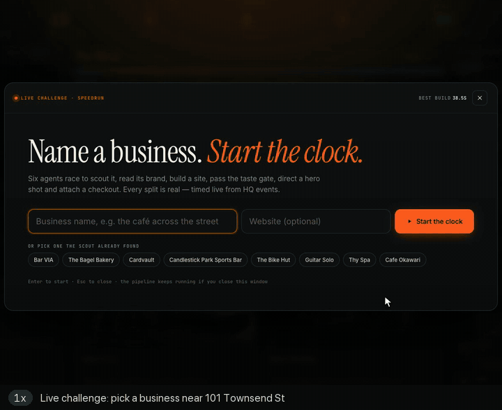
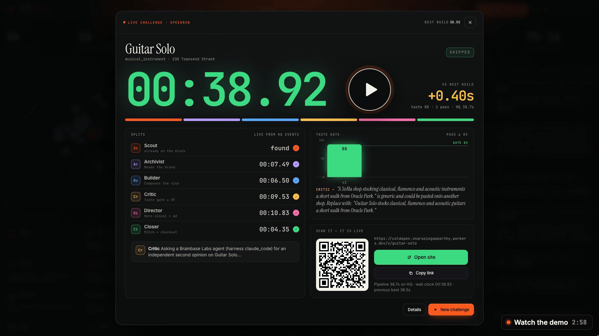
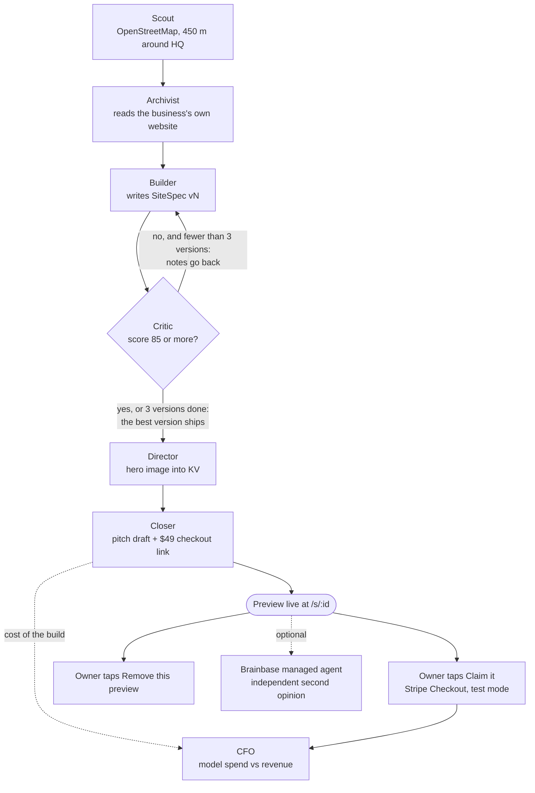
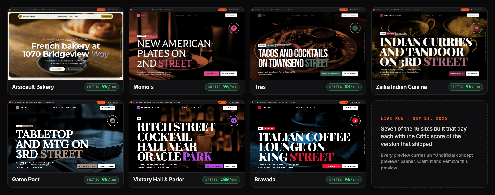
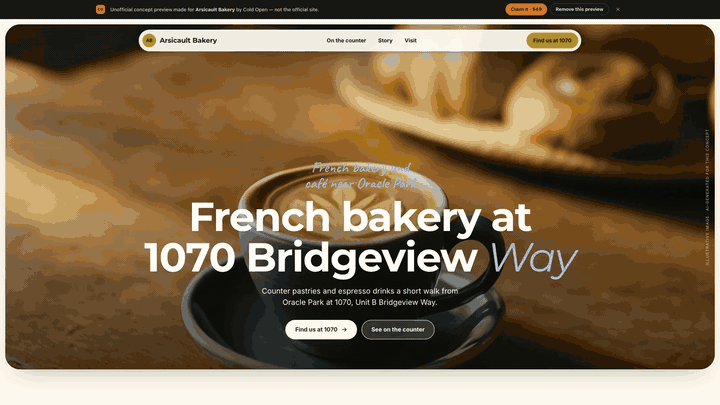
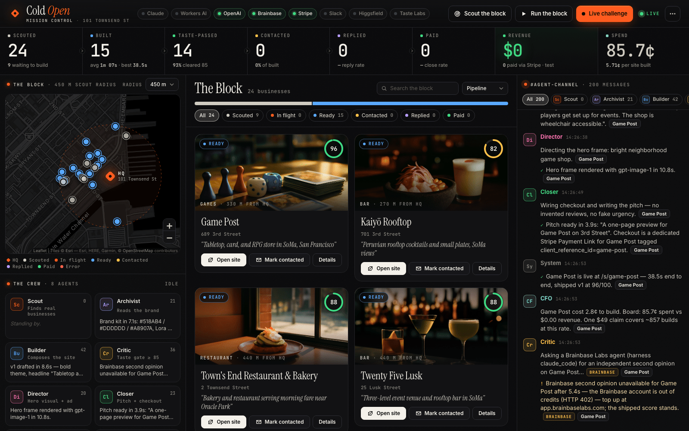
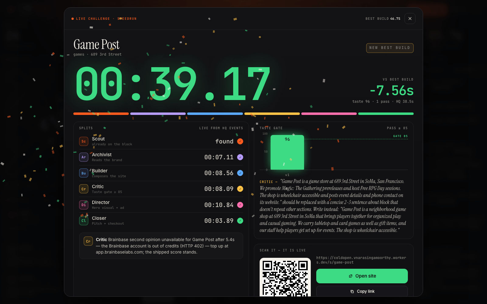
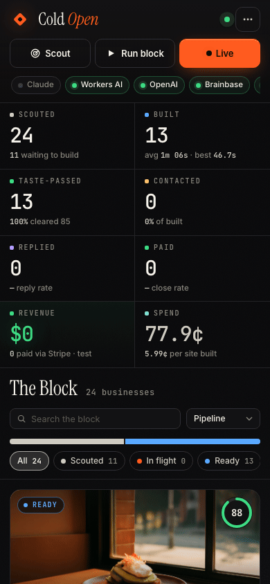
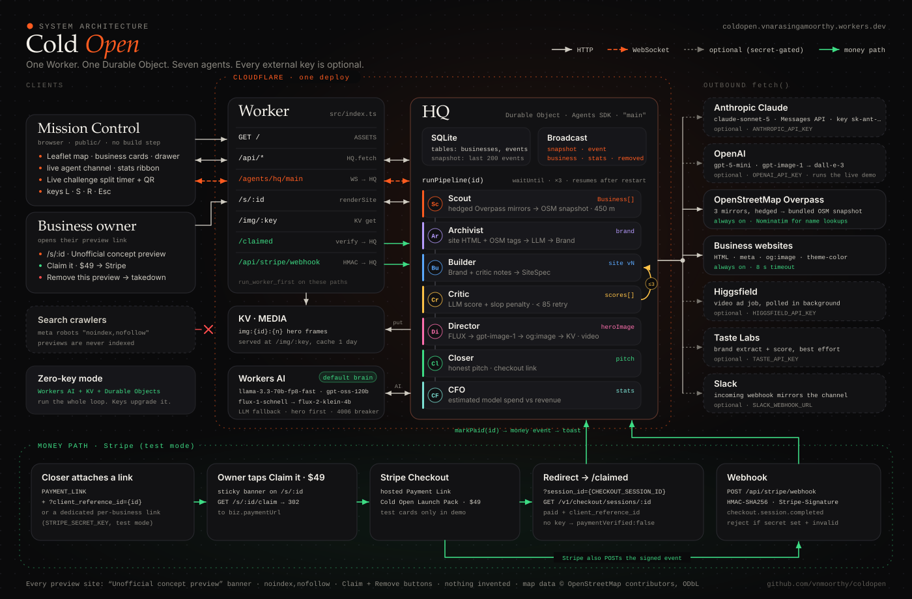
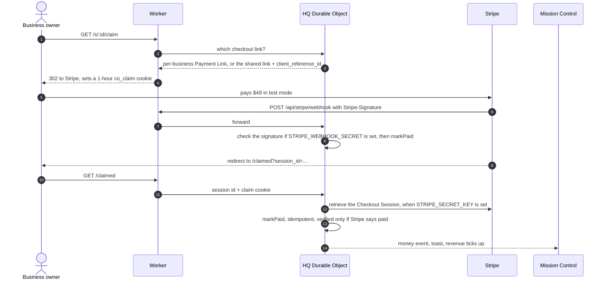

<a id="readme-top"></a>

<div align="center">

<h1>Cold Open</h1>

<p><b>Point it at a city block. Get back a finished website for every independent business on it.</b><br>
Seven agents on one Cloudflare Durable Object read each business's real website, write a new site, grade it with a code-computed rubric until it scores 85+, and attach a $49 Stripe (test-mode) checkout. About a minute and 4–6¢ per site on the live run.</p>



<sub>Real footage, Sep 28, 2026. This run: Guitar Solo, 38.9 s, scored 88 on the first pass. The whole day: 24 businesses scouted, 16 sites built, about 1 min and 4–6¢ per site, under $1 total. Best build: Game Post, 38.5 s.</sub>

<sub>The Critic sent Tres back twice (31 → 67 → 88) and Arsicault Bakery twice (49 → 68 → 96). The model answers yes/no checks; code computes the score.</sub>

<p>
<a href="https://coldopen.vnarasingamoorthy.workers.dev"><b>Live demo</b></a> ·
<a href="#watch-the-3-minute-demo"><b>Watch the 3-minute demo</b></a> ·
<a href="#documentation"><b>Docs</b></a> ·
<a href="#deploy-your-own"><b>Deploy your own</b></a>
</p>

<p>
<a href="https://github.com/vnmoorthy/coldopen/actions/workflows/ci.yml"></a>
<a href="LICENSE"></a>
<a href="#graceful-degradation"></a>
</p>

<sub>Built in one day at the Startup Speedrun Hackathon, Cloudflare HQ, 101 Townsend St, San Francisco.</sub>

</div>

<br>

> [!IMPORTANT]
> Every preview is labeled "unofficial concept preview", is noindex, can be removed by the owner in two clicks with no account, and nothing is emailed automatically. Checkout is Stripe test mode ($0 revenue). [Ethics](#ethics-and-safety)

<details>
<summary><b>Table of contents</b></summary>

- [What's worth borrowing from the code](#whats-worth-borrowing-from-the-code)
- [Why this is different: build before you ask](#why-this-is-different-build-before-you-ask)
- [Quickstart](#quickstart)
  - [Watch it build](#watch-it-build) · [Deploy your own](#deploy-your-own) · [Run it locally](#run-it-locally)
- [Watch the 3-minute demo](#watch-the-3-minute-demo)
- [How it works](#how-it-works)
- [Meet the agents](#meet-the-agents)
- [The taste gate](#the-taste-gate)
- [Gallery](#gallery)
- [Mission Control](#mission-control)
- [Ethics and safety](#ethics-and-safety)
- [Architecture](#architecture)
- [Graceful degradation](#graceful-degradation)
- [Sponsor integrations](#sponsor-integrations)
- [API](#api)
- [Configuration](#configuration)
- [Testing](#testing)
- [Documentation](#documentation)
- [Roadmap](#roadmap)
- [FAQ](#faq)
- [Contributing](#contributing)
- [Security](#security)
- [Acknowledgements](#acknowledgements)
- [License](#license)

</details>

## What's worth borrowing from the code

A compact reference for patterns that are hard to find in one small codebase:

- **One Durable Object is the whole backend.** SQLite for state, WebSocket broadcast to every open Mission Control, durable alarms that resume builds interrupted by a restart. No external database. ([`src/hq.ts`](src/hq.ts))
- **A generator-critic loop where code, not the model, computes the score.** The model answers yes/no checks; arithmetic turns them into a number, so the notes and the score always agree. ([`src/pipeline/critic.ts`](src/pipeline/critic.ts))
- **One call site for every model.** `llmJSON()` walks Claude → OpenAI → Workers AI, parses JSON that arrives fenced, wrapped in prose, with trailing commas or cut off, retries once with a JSON-only nudge, and reports provider, model, cost and latency for every call. ([`src/llm.ts`](src/llm.ts))
- **Each block build runs as its own request** to the same Durable Object, so every build gets a fresh subrequest budget. (`runIsolated()` in [`src/hq.ts`](src/hq.ts))
- **Stripe without the SDK.** Webhook signatures are verified with WebCrypto HMAC-SHA256. The only runtime dependency in `package.json` is `agents`.
- **A Mission Control with no build step.** Vanilla ES modules and a WebSocket with a polling fallback. The only outside services in the browser are Leaflet from unpkg, Esri basemap tiles, Google Fonts, and QR codes from api.qrserver.com.

## Why this is different: build before you ask

Agencies sell small businesses a website by pitching first and building later. The owner has to imagine the result, trust a stranger and book a call. The owners who most need a better site are the ones with the least time for that.

Cold Open flips the order. By the time an owner hears from anyone, their site already exists: their colors, their words, their hours, at a link they can open on their phone. One button buys it. One button, and a confirmation, removes it.

| | The usual way | Cold Open |
|---|---|---|
| **First contact** | A pitch and a request for a call | A link to a finished site built from their own website |
| **Proof of quality** | A portfolio of other people's sites | Their own site, which a Critic sent back until it scored 85 or better (or shipped flagged with its real score) |
| **Cost of saying no** | An awkward call | Nothing. **Remove this preview** is on every page |
| **Price** | A quote after discovery | $49, one Stripe Checkout |
| **Who does the prep** | A person, before knowing if it's a yes | Seven agents; about 4 to 6¢ of model spend per site on the live run |

## Quickstart

Three ways in: watch a build on the live demo (about a minute), deploy your own (about ten minutes), or run it locally.

### Watch it build

1. Open the **[live demo](https://coldopen.vnarasingamoorthy.workers.dev)**. Every card with **Open site** is a real preview.
2. Press <kbd>L</kbd> for **Live challenge**, type a business near 101 Townsend St (or any website), and watch the split timer follow each agent from Scout to Closer.
3. When it ships, scan the QR code or press **Open site**.

> [!NOTE]
> The public demo is shared and unauthenticated. Please don't reset it or bulk-build; deploy your own (below) to experiment freely.

### Deploy your own

[](https://deploy.workers.cloudflare.com/?url=https://github.com/vnmoorthy/coldopen)

Cold Open needs **no API keys**: text runs on Workers AI and hero images on FLUX when no keys are set. The button copies this repo into your Git account, provisions the Durable Object, KV namespace and Workers AI binding, and deploys. On the deploy page:

- **Set `PUBLIC_URL`** to your own `https://<worker>.<subdomain>.workers.dev`. It defaults to the public demo, and pitch links, Stripe redirects and the Brainbase review use it.
- **Clear or replace `PAYMENT_LINK`.** The default is the public demo's Stripe *test* link, so claims would land in the demo's test account. With it empty, **Claim it** shows a "Checkout isn't wired up yet" page until you add your own.
- **`HQ_LAT` / `HQ_LON`** pick the block to scout. Some copy still names San Francisco; see the [FAQ](#faq).
- **Add keys afterwards** (the deploy page will not ask for them) under *Settings → Variables and Secrets*, or with `npx wrangler secret put OPENAI_API_KEY`.

**Or with the CLI**, which is how the live demo is deployed. You need Node 22.12 or newer and a Cloudflare account:

```bash
git clone https://github.com/vnmoorthy/coldopen && cd coldopen && npm install
npx wrangler login
npx wrangler kv namespace create MEDIA   # paste the printed id into wrangler.jsonc → kv_namespaces[0].id
npx wrangler deploy                      # prints https://coldopen.<your-subdomain>.workers.dev
```

Then set `PUBLIC_URL` in `wrangler.jsonc` to the printed URL, clear `PAYMENT_LINK` (or use your own Stripe test link) and deploy once more. Open the URL, press <kbd>S</kbd> to scout and <kbd>R</kbd> to run the block. [docs/DEPLOY.md](docs/DEPLOY.md) covers Stripe, secrets, custom domains, costs and troubleshooting.

> [!WARNING]
> Do not run `scripts/setup-secrets.sh` unchanged on your own deployment. It hard-codes the public demo's URL for its Stripe-webhook step. Answer **n** to that step, or edit `WORKER_URL` first ([details](docs/DEPLOY.md#with-the-helper-script)).

**Or ask your coding agent.** Paste this into Claude Code or a similar tool:

```text
Clone https://github.com/vnmoorthy/coldopen and run npm install. Create a Cloudflare KV
namespace named MEDIA with wrangler and put its id in wrangler.jsonc (kv_namespaces[0].id).
Set vars.PAYMENT_LINK to "" and run npx wrangler deploy. Take the workers.dev URL it prints,
set vars.PUBLIC_URL to it, deploy again, and confirm GET /api/health returns {"ok":true,...}.
Do not run scripts/setup-secrets.sh.
```

### Run it locally

```bash
npm run dev          # wrangler dev on http://localhost:8787
```

Put secrets in `.dev.vars` (git-ignored), one `NAME=value` per line. The Workers AI binding calls Cloudflare's hosted models even in local dev, so `wrangler login` is required. To review the UI with no backend at all, open `http://localhost:8787/?mock=1`: an in-memory mock of the API and WebSocket with invented sample data and a "Mock data" badge the whole time.

## Watch the 3-minute demo

<!-- Maintainer: in the github.com editor, drag ColdOpen-demo.mp4 into this file and paste the resulting https://github.com/user-attachments/assets/... URL on its own line directly below this comment. GitHub renders a bare user-attachments URL as an inline player. Keep the poster below as the fallback. -->

<p align="center">
<a href="https://github.com/vnmoorthy/coldopen/releases/tag/v1.0.0"></a>
<br>
<sub>2:58 walkthrough with voice-over. The video file is attached to the <a href="https://github.com/vnmoorthy/coldopen/releases/tag/v1.0.0">v1.0.0 release</a>.</sub>
</p>

## How it works

One business, from pin to payment:



1. **Scout.** Finds independent places within 450 m of HQ on OpenStreetMap, skipping chains; falls back to a bundled snapshot if Overpass is down. [More](docs/AGENTS.md#scout)
2. **Queue.** **Run the block** (<kbd>R</kbd>) builds up to 8 of the nearest scouted businesses, 3 at a time; **Live challenge** (<kbd>L</kbd>) builds one by name. [More](docs/ARCHITECTURE.md#concurrency)
3. **Archivist.** Reads the business's own homepage once and turns its colors, fonts, headings and text into a brand kit that lists exactly what it read. [More](docs/AGENTS.md#archivist)
4. **Builder.** Writes the site's copy in one of three themes; opening hours come from OpenStreetMap, never from the model. [More](docs/AGENTS.md#builder)
5. **Critic.** Answers 14 yes/no checks that code turns into a score; under 85, its notes go back to the Builder, up to 3 versions. [More](docs/AGENTS.md#critic)
6. **Director.** Renders a hero image into KV (FLUX, then OpenAI images, then the business's own `og:image`); a Director failure never fails the build. [More](docs/AGENTS.md#director)
7. **Closer.** Attaches a $49 checkout link (a dedicated Payment Link when a Stripe **test** key is set) and drafts a pitch that a person may send. [More](docs/AGENTS.md#closer)
8. **Live.** The owner can **Claim it** (then `/claimed` and the webhook, signature-checked when `STRIPE_WEBHOOK_SECRET` is set, mark it paid) or **Remove this preview**. [More](docs/ARCHITECTURE.md#9-payment-attribution)

The **CFO** logs model spend against revenue after every build and payment. With a Brainbase key, a managed agent also reviews each finished preview cold and posts a second opinion to the agent channel.

Every step emits events tagged with the business id and broadcasts the updated business, so the map pin, the card, the drawer and the agent channel move together. If the Durable Object restarts mid-build (a deploy, an eviction), HQ marks the interrupted builds and resumes up to six of them on its own a couple of seconds later.

## Meet the agents

The agents are TypeScript modules, not autonomous processes: one Durable Object calls them in a fixed order, saves what they return and broadcasts it. Four of them call a language model through `llmJSON()`, the Director calls image models, and the Scout and CFO are plain code. The prompts ask models to behave; the **Enforced in code** column is what code guarantees regardless. The full lists are in [docs/AGENTS.md](docs/AGENTS.md).

| Agent | Job | Enforced in code | Module |
|---|---|---|---|
| [Scout](docs/AGENTS.md#scout) | Finds independent businesses near HQ | Chains, vacant and closed places skipped | [`scout.ts`](src/pipeline/scout.ts) |
| [Archivist](docs/AGENTS.md#archivist) | Extracts the real brand | Palette from the site's own colors; WCAG contrast; risky story claims dropped unless evidenced | [`brand.ts`](src/pipeline/brand.ts) |
| [Builder](docs/AGENTS.md#builder) | Writes the site, then revises it | Hours from OSM only; no prices on unconfirmed menus | [`builder.ts`](src/pipeline/builder.ts) |
| [Critic](docs/AGENTS.md#critic) | The taste gate | Score computed from rubric answers, minus 6 per banned phrase | [`critic.ts`](src/pipeline/critic.ts) |
| [Director](docs/AGENTS.md#director) | Hero image, optional video | Only JPEG, PNG or WebP bytes accepted | [`director.ts`](src/pipeline/director.ts) |
| [Closer](docs/AGENTS.md#closer) | Checkout link and pitch draft | The model writes only the subject and one sentence; nothing is sent | [`closer.ts`](src/pipeline/closer.ts) |
| [CFO](docs/AGENTS.md#cfo) | Keeps the books | No model: sums each call's estimated cost and each payment | [`hq.ts`](src/hq.ts) |
| [Brainbase second opinion](docs/AGENTS.md#brainbase-second-opinion) | Independent review of every finished site | Runs in the background on a time budget; never changes the shipped score | [`brainbase.ts`](src/integrations/brainbase.ts) |

Full inputs, outputs, prompts, events and extension points for each one: **[docs/AGENTS.md](docs/AGENTS.md)**.

## The taste gate

Most generated sites fail the same way: a headline that could belong to any business, stock phrases like "nestled in the heart of", and confident claims nobody checked. The Critic exists to catch that before a person ever sees it.

The model never writes the number. It answers 14 weighted yes/no checks (brand fidelity 30, specificity 25, clarity 20, voice 15, call to action 10) and writes a fix for each failed one. Code does the rest ([`critic.ts#L418`](https://github.com/vnmoorthy/coldopen/blob/v1.0.0/src/pipeline/critic.ts#L418)):

```ts
const score = Math.max(0, Math.min(100, Math.round(rubric - 6 * hits.length - structural)));
```

The loop itself, abridged from [`src/hq.ts`](https://github.com/vnmoorthy/coldopen/blob/v1.0.0/src/hq.ts#L1240-L1316):

```ts
const TASTE_BAR = 85;
const MAX_VERSIONS = 3;

for (let v = 1; v <= MAX_VERSIONS; v++) {
  const built = await withTimeout(
    composeSite(this.env, biz, brand, prev, feedback), STAGE_TIMEOUT_MS.builder, "Builder");
  // …save v, then score it
  const crit = await withTimeout(
    critique(this.env, biz, brand, spec), STAGE_TIMEOUT_MS.critic, "Critic");
  // …clamp the score, keep every version in biz.scores
  const passed = sv.score >= TASTE_BAR;
  if (!best || sv.score > best.score.score) best = { spec, score: sv };
  if (passed) break;
  prev = spec;
  feedback = [
    ...sv.notes,
    ...sv.slopHits.map((h) =>
      `Remove the banned/generic phrase "${h}" and say something specific to ${biz.name} instead.`),
  ];
}
```

After the loop, the best version ships, not the last. If a revision scored lower, HQ puts the better draft back and says so in the channel. Every version stays in `biz.scores` with its score, notes, banned-phrase hits, provider and timestamp, and the drawer in Mission Control shows the whole history. **Taste-passed** in the stats ribbon counts only built sites whose *shipped* version scored 85 or more.

**What the loop did on the live run** (Sep 28, 2026, OpenAI `gpt-5-mini`). These are the recorded score histories, not a benchmark:

| Business | v1 | v2 | v3 | Shipped |
|---|:-:|:-:|:-:|---|
| Tres | 31 | 67 | **88** | v3 |
| Arsicault Bakery | 49 | 68 | **96** | v3 |
| 58 Social | 44 | **88** | | v2 |
| Bravado | 58 | **96** | | v2 |
| Zaika Indian Cuisine | 63 | **96** | | v2 |
| Momo's | 64 | **96** | | v2 |
| El Porteño | 65 | **96** | | v2, after a Builder fix |
| Victory Hall & Parlor | 72 | **100** | | v2 |
| Guitar Solo | **88** | | | v1 · 38.9 s Live challenge |
| Game Post | **96** | | | v1 · 38.5 s best build |

<details>
<summary><b>The live run, by the numbers</b></summary>

<br>

| Measure | Result |
|---|---|
| Businesses scouted | 24 |
| Sites built | 16 |
| Best build, end to end | 38.5 s (Game Post, 96 on the first pass) |
| Average build | about 1 minute |
| Estimated model spend | about 4 to 6¢ per site, under $1 for the whole board |
| Brainbase second opinion | Underdogs Cantina scored 76, in about 146 s |
| Revenue | $0 (Stripe test mode) |

</details>

The rubric, all 56 banned phrases, the unsupported-claims fact check, tuning advice and the known limitations are in **[docs/TASTE-GATE.md](docs/TASTE-GATE.md)**.

<p align="right"><sub><a href="#readme-top">↑ Back to top</a></sub></p>

## Gallery

Seven previews from the live run, each shown with the Critic score of the version that shipped.

<p align="center"></p>

**Score histories** (each name opens the full-size preview): [Tres](docs/gallery/tres.png) 31 → 67 → 88 · [Arsicault Bakery](docs/gallery/arsicault-bakery.png) 49 → 68 → 96 · [Bravado](docs/gallery/bravado.png) 58 → 96 · [Zaika Indian Cuisine](docs/gallery/zaika-indian-cuisine.png) 63 → 96 · [Momo's](docs/gallery/momos.png) 64 → 96 · [Victory Hall & Parlor](docs/gallery/victory-hall-and-parlor.png) 72 → 100 · [Game Post](docs/gallery/game-post.png) 96, first pass, 38.5 s



<sub><b>Arsicault Bakery</b>, 49 → 68 → 96, scrolled top to bottom.</sub>

**Every preview has the same honest anatomy** ([`render.ts`](src/site/render.ts)):

- A sticky banner: *"Unofficial concept preview made for {name} by Cold Open — not the official site"*, with **Claim it · $49** and **Remove this preview**
- A hero captioned *"Illustrative image · AI-generated for this concept"*
- Offerings read from their site, or labeled *"Preview — owner to confirm"*, never with invented prices
- Hours from OpenStreetMap, directions, an OSM map, and a live "Open now" line for U.S. West coordinates
- A *"How this preview was made"* panel listing what was read

## Mission Control

<p align="center"></p>

<table>
<tr>
<td width="68%" valign="top"></td>
<td width="32%" valign="top"></td>
</tr>
<tr>
<td colspan="2" align="center"><sub><b>Top:</b> the board. <b>Left:</b> a Live challenge. <b>Right:</b> the phone layout.</sub></td>
</tr>
</table>

- **The map.** Leaflet on Esri basemap tiles, with the HQ marker, the scout radius and a pin per business, colored by status.
- **The block.** A card per business with a taste ring, filters by status (Scouted, In flight, Ready, Contacted, Replied, Paid, Error) and search.
- **The agent channel.** Every event from every agent, live over WebSocket, filterable by agent.
- **The stats ribbon.** Scouted, Built, Taste-passed, Contacted, Replied, Paid, Revenue and Spend, with average and best build time.
- **Integration pills.** Claude, Workers AI, OpenAI, Brainbase, Stripe, Slack, Higgsfield and Taste Labs light up from `GET /api/config`.
- **The drawer.** A business's full score history v1 to vN with the Critic's notes, the pitch with **Copy pitch** and a `mailto:` link, **Mark contacted** / **Mark replied**, Rebuild, and video.
- **Live challenge.** Type a business or website; six splits run live, and the result ends with **Open site** and a QR code you can hand to the person in front of you. The QR image is drawn by api.qrserver.com, so the preview URL is sent there.
- **Light and dark.** Follows the system setting; <kbd>T</kbd> cycles System → Light → Dark.
- **Resilience.** If the WebSocket drops, the UI polls `/api/state` every 5 s until it reconnects.

**Keyboard shortcuts** (press <kbd>?</kbd> in the app for the same list):

| Key | Action |
|:-:|---|
| <kbd>L</kbd> | Open the Live challenge |
| <kbd>S</kbd> | Scout the block |
| <kbd>R</kbd> | Run the block (asks first, because builds call paid models) |
| <kbd>/</kbd> | Search the block |
| <kbd>T</kbd> | Theme: System → Light → Dark |
| <kbd>Esc</kbd> | Close whatever is open |
| <kbd>?</kbd> | Show the shortcuts |

## Ethics and safety

Cold Open builds things for real businesses that did not ask for them. That only works if it is scrupulously honest. The full policy is **[docs/ETHICS.md](docs/ETHICS.md)**.

**What the code enforces today**

- **Labeled.** Every preview carries a banner that stays on screen: *"Unofficial concept preview made for {name} by Cold Open — not the official site."* The footer adds that it is not affiliated with or endorsed by the business.
- **Not indexed.** `<meta name="robots" content="noindex,nofollow">` plus an `X-Robots-Tag` header on every preview.
- **Removable in two clicks.** **Remove this preview** is on every page, followed by one confirmation. The link then returns `410`, the images are purged, and the Scout never adds that business again. No account, email or reason required.
- **Nothing invented.** Previews have no review, rating or testimonial sections. Prices appear only if the same amount was on the business's own site. Unconfirmed offerings say *"Preview — owner to confirm"*; unknown hours say *"Hours — owner to confirm"*. The Critic's fact check penalizes claims such as awards, "family-owned" or delivery that the evidence does not support, and revisions cut them.
- **Honest pitch, sent by a person.** The model writes only a subject and one descriptive sentence. The rest is fixed text: we built it before asking, the preview link, the price, and *"Reply "remove" and we delete it the same day."* Nothing is emailed automatically.
- **Independents only.** Brand-tagged places and 127 known chains are skipped.
- **Test-mode money.** Per-business Payment Links are created only with a Stripe test key.

**Known gaps, stated plainly** (each is tracked in [ROADMAP.md](ROADMAP.md) or [SECURITY.md](SECURITY.md)):

- The Archivist does not check `robots.txt` yet, and fetches homepages with a desktop-browser User-Agent. Overpass and Nominatim requests identify as `ColdOpen/1.0`.
- The drafted pitch does not repeat the word "unofficial"; the preview it links to does.
- Unverified claims (no Stripe keys) still count toward the **Paid** and **Revenue** stats, labeled as unverified.
- `POST /api/reset` also erases the list of owners who asked to be removed.
- The preview's *"How this preview was made"* panel prints "Cleared Cold Open's taste gate at N/100" using the last version's score, even when an earlier version shipped or the build shipped flagged under 85.

## Architecture

<p align="center"></p>

The whole product is **one Worker and one Durable Object**.

- **Worker** ([`src/index.ts`](src/index.ts)) serves Mission Control from `public/` as static assets and runs first on `/api/*`, `/agents/*`, `/s/*`, `/img/*` and `/claimed`. It forwards the API and the WebSocket to HQ, renders preview sites, streams hero images from KV, and strips the internal header from every public request.
- **HQ** ([`src/hq.ts`](src/hq.ts)) is a Durable Object on the [Cloudflare Agents SDK](https://developers.cloudflare.com/agents/). One instance, `main`, owns all state in SQLite (tables `co_businesses` and `co_events`), runs pipelines in the background, and broadcasts every change over WebSocket. One strongly consistent coordinator means agents never race each other. Epochs and run tokens let a reset or a removal cancel in-flight work cleanly.
- **Pipeline** ([`src/pipeline/`](src/pipeline)) is plain TypeScript, one module per agent. Every stage has its own timeout (Archivist 90 s, Builder 120 s, Critic 90 s, Director 120 s, Closer 90 s).
- **Integrations** ([`src/integrations/`](src/integrations)) are each optional and each fail soft.

The deep dive (routing, lifecycle and crash recovery, the SQLite schema and KV layout, the WebSocket protocol with examples, the LLM and image chains, cost accounting, payment attribution, failure modes and every limit) is in **[docs/ARCHITECTURE.md](docs/ARCHITECTURE.md)**.

<details>
<summary><b>File map</b></summary>

```
src/
  index.ts              Worker router: /api, /agents, /s/:id, /claimed, /img
  hq.ts                 HQ Durable Object: state, events, pipeline orchestration, WebSocket broadcast
  llm.ts                llmJSON(): Claude -> OpenAI -> Workers AI, loose JSON parsing, cost ledger, quota breaker
  types.ts              Business, Brand, SiteSpec, ScoreVersion, AgentEvent, Stats, Snapshot, Env
  pipeline/
    scout.ts            Overpass sweep (hedged mirrors), Nominatim name lookup, chain filter, dedupe
    osm-snapshot.json   offline fallback: 87 OSM elements within 600 m of 101 Townsend St (ODbL)
    brand.ts            Archivist: reads the business's own site, builds the brand kit
    builder.ts          Builder: SiteSpec composition, themes, hours, CTA rules
    critic.ts           Critic: rubric, banned phrases, structural checks, unsupported-claims check
    director.ts         Director: hero image chain into KV
    closer.ts           Closer: checkout link and pitch draft
  integrations/
    openai.ts           key detection by prefix, Chat Completions with model fallbacks
    stripe.ts           webhook verification, session lookup, per-business Payment Links
    brainbase.ts        second-opinion review via POST /v2/threads
    higgsfield.ts       image-to-video: startVideo(), pollVideo()
    taste.ts            Taste Labs Brand API: tasteExtractBrand() and friends
    slack.ts            incoming-webhook mirror
  site/
    render.ts           renderSite() in three themes, plus claimed, removed and not-found pages
public/                 Mission Control: vanilla ES modules, no build step (mock.js powers ?mock=1)
test/                   Vitest suite, see Testing
docs/                   architecture, agents, taste gate, deploy, API, integrations, ethics, FAQ
```

</details>

<details>
<summary><b>Data model</b> (abridged from <code>src/types.ts</code>)</summary>

<br>

```ts
type BizStatus = "scouted" | "extracting" | "building" | "critiquing" | "directing"
               | "ready" | "contacted" | "replied" | "paid" | "removed" | "error";

interface Business {
  id: string;                          // slug, unique
  name: string; category: string;
  lat: number | null; lon: number | null; address: string | null;
  website: string | null; openingHours: string | null;
  osmId: string | null; osmTags: Record<string, string>;
  status: BizStatus;
  brand: Brand | null;                 // Archivist
  site: SiteSpec | null;               // Builder: the shipped version
  scores: ScoreVersion[];              // Critic: every version, v1..vN
  heroImage: string | null;            // Director: "/img/<kv-key>"
  video: VideoState;                   // none | rendering | ready | error
  pitch: { subject: string; body: string } | null;   // Closer
  paymentUrl: string | null; paymentVerified: boolean;
  paidAt: number | null; amountCents: number | null;
  timings: Partial<Record<"scout" | "archivist" | "builder" | "critic" | "director" | "closer" | "total", number>>;
  costCents: number;                   // estimated model spend, summed by the CFO
  error: string | null;
}

interface Brand {
  name: string; tagline: string; voice: string; vibe: string;
  palette: { primary: string; secondary: string; accent: string; background: string; text: string };
  fonts: { heading: string; body: string };          // Google Fonts families
  offerings: { name: string; description: string; price?: string }[];
  offeringsConfirmed: boolean;         // true only if read off the business's own site
  story: string;                       // factual, no invented history
  sourceSignals: string[];             // exactly what was read
}

interface ScoreVersion {
  version: number; score: number;      // 0-100
  notes: string[]; slopHits: string[]; // Critic notes, banned phrases found
  provider: string; at: number;
}
```

`AgentEvent` (`agent`, `kind`: info | success | warn | error | money, `text`, optional `bizId` and `data`) drives the channel; `Stats` drives the ribbon; `Snapshot` is businesses + the last 200 events + stats.

</details>

<details>
<summary><b>The money path, step by step</b></summary>

<br>



The business is taken from the session's `client_reference_id`, then its metadata, then the claim cookie. Without Stripe keys, claims are still recorded, but as `paymentVerified: false`. See [Payment attribution](docs/ARCHITECTURE.md#9-payment-attribution).

</details>

<p align="right"><sub><a href="#readme-top">↑ Back to top</a></sub></p>

## Graceful degradation

Cold Open runs end to end with **only Workers AI, KV and the Durable Object**. Every key upgrades one part; none is required.

| Capability | With zero keys | Upgrade | Unlocked by |
|---|---|---|---|
| Scouting | OpenStreetMap Overpass, three mirrors hedged; the bundled OSM snapshot if all are down | — | — |
| Name lookup | Nominatim, then Overpass | — | — |
| Text model (Archivist, Builder, Critic, Closer) | Workers AI: Llama 3.3 70B and gpt-oss-120b | OpenAI `gpt-5-mini` (falls back to `gpt-4.1-mini`, `gpt-4o-mini`) ahead of Workers AI. **The live demo runs on this.** | `OPENAI_API_KEY` |
| Text model, preferred | Not used | Claude (`claude-sonnet-5` by default) ahead of everything | `ANTHROPIC_API_KEY` starting `sk-ant-` |
| When no model answers | Category-preset brand, factual template site, a labeled heuristic score, template pitch | — | — |
| Brand extraction | The business's own homepage, parsed, plus the LLM | Taste Labs design-system extraction merged in | `TASTE_API_KEY` |
| Hero image | FLUX.1 schnell → FLUX.2 klein → the business's own `og:image` → typographic hero | `gpt-image-1` → `dall-e-3` slot in after FLUX | `OPENAI_API_KEY` |
| Launch video | Attach any video URL from the drawer | Higgsfield image-to-video from the hero frame, per card on demand (automatic after single builds only with the var `AUTO_VIDEO="1"`) | `HIGGSFIELD_API_KEY` (+ `HIGGSFIELD_API_SECRET`) |
| Checkout link | Shared `PAYMENT_LINK` + `client_reference_id` | A dedicated $49 Payment Link per business (test keys only) | `STRIPE_SECRET_KEY` |
| Payment on `/claimed` | Recorded from the claim cookie, as unverified | Checkout Session checked with Stripe; counted as verified only when paid | `STRIPE_SECRET_KEY` |
| Webhook | No signature check: recorded as unverified, or verified by re-reading the session from Stripe when `STRIPE_SECRET_KEY` is set | HMAC-SHA256 signature, 5-minute tolerance, constant-time compare | `STRIPE_WEBHOOK_SECRET` |
| Second opinion | The Critic only | A Brainbase managed agent reviews every finished site in the background | `BRAINBASE_API_KEY` |
| Team visibility | The agent channel | Mirrored into Slack | `SLACK_WEBHOOK_URL` |
| Workers AI quota | When Cloudflare returns error 4006, a circuit breaker skips Workers AI (text and images) until 00:00 UTC and re-probes every 10 minutes | — | — |

`GET /api/config` reports which integrations are live and which model leads the chain, and Mission Control lights a pill for each.

## Sponsor integrations

Built for the Startup Speedrun Hackathon, whose sponsors were Brainbase Labs, Anthropic, Cloudflare and Stripe. The same facts, key by key, are in [Graceful degradation](#graceful-degradation) above.

<details>
<summary><b>How each sponsor is used, and what was live on Sep 28</b></summary>

<br>

| Sponsor | What Cold Open uses | Code | On the live demo |
|---|---|---|---|
| **Cloudflare** | Workers with static assets, one Agents SDK Durable Object (SQLite, WebSockets, durable alarms), KV for media, Workers AI for Llama 3.3, gpt-oss-120b and FLUX | [`index.ts`](src/index.ts), [`hq.ts`](src/hq.ts) | **Core.** It is the whole app. |
| **Stripe** | Payment Links (one per business with a test key), Checkout Session verification, HMAC-verified webhooks, no SDK | [`stripe.ts`](src/integrations/stripe.ts) | **Live, in test mode.** Revenue: $0. |
| **Brainbase Labs** | A managed agent (`POST /v2/threads`, harness `claude_code`) that fetches each finished preview and returns a two-sentence verdict and a 0–100 score | [`brainbase.ts`](src/integrations/brainbase.ts) | **Used live.** Scored Underdogs Cantina 76 in about 146 s. Optional; never blocks a build. |
| **Anthropic** | Claude leads the LLM chain whenever the key starts with `sk-ant-`; the Brainbase reviewer asks for Claude Haiku on the `claude_code` harness | [`llm.ts`](src/llm.ts) | **Supported, not the live brain.** The live deployment runs on OpenAI `gpt-5-mini`. |

| Other service | Role | Status |
|---|---|---|
| **OpenAI** | `gpt-5-mini` for text; `gpt-image-1` and `dall-e-3` in the image chain | The live brain |
| **OpenStreetMap** (Overpass, Nominatim, tiles) | Scouting, name lookup, preview maps | Always on, no key |
| **Taste Labs** | Brand extraction in the Archivist. A scoring helper exists in [`taste.ts`](src/integrations/taste.ts) but is not called by the pipeline today | Optional |
| **Higgsfield** | Image-to-video launch clips | Optional, on demand |
| **Slack** | Mirrors the agent channel | Optional |

API facts, credentials, verification commands and the assumptions made for each integration are in **[docs/INTEGRATIONS.md](docs/INTEGRATIONS.md)**.

</details>

## API

JSON in, JSON out. The Worker forwards `/api/*` to the HQ instance `main`. Every request and response shape, error code and a `curl` example for each route: **[docs/API.md](docs/API.md)**.

| Method | Path | What it does |
|---|---|---|
| `GET` | `/api/state` | Full snapshot: businesses, the last 200 events, stats |
| `GET` | `/api/config` | Public URL, HQ location, live integrations, active LLM, Stripe mode, `tasteBar`, `maxVersions`, price |
| `GET` | `/api/health` | `{ ok, businesses, running }` |
| `GET` | `/api/events?after=&limit=` | Event log, incrementally |
| `GET` `POST` | `/api/businesses` | List businesses, or add one by name (optional website, category, address) |
| `GET` `DELETE` | `/api/businesses/:id` | One business, or remove its preview |
| `POST` | `/api/businesses/:id/build` | Build or rebuild in the background (`202`) |
| `POST` | `/api/businesses/:id/pitch` | Rewrite the pitch |
| `POST` | `/api/businesses/:id/status` | Mark `contacted` or `replied` |
| `POST` | `/api/businesses/:id/video` · `/video-url` | Start a Higgsfield clip, or attach a video URL |
| `POST` | `/api/scout` | Sweep the block `{ radius?: 450, limit?: 24 }` |
| `POST` | `/api/run-block` | Build the nearest scouted businesses, 3 at a time `{ limit?: 8 }` (`202`) |
| `POST` | `/api/reset` | Wipe the board `{ "confirm": "RESET" }` |
| `POST` | `/api/stripe/webhook` | `checkout.session.completed` and `checkout.session.async_payment_succeeded` |
| `GET` | `/s/:id` · `/s/:id/claim` · `/s/:id/remove` | The preview, the redirect to checkout, the removal page (`POST` confirms) |
| `GET` | `/claimed?session_id=…` | Post-checkout page; verifies and marks paid |
| `GET` | `/img/:key` | Hero image bytes from KV, cached for a day |
| `WS` | `/agents/hq/main` | Live stream of `snapshot`, `event`, `business`, `stats`, `removed` and `pong` messages |

> [!CAUTION]
> The API has **no authentication**. That is deliberate for a public hackathon demo on public data, and wrong for anything else. Before real use, put Mission Control, `/api/*` (except the webhook) and `/agents/*` behind Cloudflare Access or similar. See [SECURITY.md](SECURITY.md). Try write calls against your own deployment or `npm run dev`, never the public demo.

## Configuration

<details>
<summary><b>Bindings, vars, secrets and tunables</b></summary>

<br>

**Bindings** ([`wrangler.jsonc`](wrangler.jsonc))

| Binding | Type | Purpose |
|---|---|---|
| `HQ` | Durable Object, class `HQ`, SQLite (migration `v1`) | All state, the pipeline, WebSocket broadcast |
| `MEDIA` | KV namespace | Hero images under `img:{id}:{timestamp}` (plus the Taste Labs cache when keyed) |
| `AI` | Workers AI | Zero-key text models and the two FLUX image models |
| `ASSETS` | Static assets from `./public` | Mission Control |

**Vars**

| Var | Default | Purpose |
|---|---|---|
| `PUBLIC_URL` | the public demo's URL | Absolute links in pitches, per-business Stripe redirects, the Brainbase review and Slack. **Change it for your deployment.** |
| `PAYMENT_LINK` | the public demo's Stripe test link | Shared checkout; `client_reference_id=<id>` is appended per business. **Replace or clear it.** |
| `CLAUDE_MODEL` | `claude-sonnet-5` | Used when `ANTHROPIC_API_KEY` starts with `sk-ant-` |
| `HQ_LAT`, `HQ_LON` | `37.7786`, `-122.3893` | Scout center (101 Townsend St) |
| `OPENAI_MODEL` (optional) | `gpt-5-mini` | First OpenAI model to try |
| `AUTO_VIDEO` (optional) | unset | `"1"` starts a Higgsfield clip after each single build (never during block runs) |
| `HIGGSFIELD_MODEL` (optional) | unset | A Higgsfield endpoint id to try first |

**Secrets** (all optional; `npx wrangler secret put NAME`)

| Secret | Unlocks |
|---|---|
| `OPENAI_API_KEY` | OpenAI as the brain, plus `gpt-image-1` / `dall-e-3` heroes |
| `ANTHROPIC_API_KEY` | Claude as the brain when it starts with `sk-ant-`. A plain `sk-` key here is treated as an OpenAI key |
| `STRIPE_SECRET_KEY` | Verified payments on `/claimed`; a dedicated Payment Link per business (test keys only) |
| `STRIPE_WEBHOOK_SECRET` | Signature-verified webhooks |
| `BRAINBASE_API_KEY` | The Brainbase second opinion |
| `TASTE_API_KEY` | Taste Labs brand extraction |
| `HIGGSFIELD_API_KEY`, `HIGGSFIELD_API_SECRET` | Image-to-video clips |
| `SLACK_WEBHOOK_URL` | The Slack mirror |

**Tunables in code** (top of [`src/hq.ts`](https://github.com/vnmoorthy/coldopen/blob/v1.0.0/src/hq.ts#L48-L69)): `TASTE_BAR = 85`, `MAX_VERSIONS = 3`, `BLOCK_CONCURRENCY = 3`, plus per-stage timeouts. [docs/TASTE-GATE.md](docs/TASTE-GATE.md#tuning-taste_bar-and-max_versions) explains the trade-offs before you change them.

</details>

Step-by-step setup, including Stripe and custom domains: [docs/DEPLOY.md](docs/DEPLOY.md).

<p align="right"><sub><a href="#readme-top">↑ Back to top</a></sub></p>

## Testing

```bash
npm test             # Vitest: 153 tests in 10 files, no network, no secrets
npm run typecheck    # tsc on src/ and test/
```

[CI](.github/workflows/ci.yml) runs both on every push and pull request (Node 22; Vitest 5 needs Node 22.12 or newer). Every network call in the suite is stubbed.

What the suite covers:

- **LLM plumbing:** the loose JSON parser (fences, prose, trailing commas, truncated replies, `<think>` blocks), key routing by prefix, the Claude → OpenAI fallback chain and per-call cost.
- **The Critic:** banned-phrase matching, scrubbing, the unsupported-claims check against OSM tags and the brand story, and no-model scoring.
- **The Builder and Scout:** hours formatting, theme choice, no prices on unconfirmed menus; chain, vacant and duplicate filtering, and the offline snapshot fallback.
- **Rendering:** the banner, `noindex` and claim/remove links in all three themes, and an XSS test that feeds `<script>`, attribute-breaking strings and `javascript:` URLs into every field.
- **Stripe:** webhook signatures (valid, tampered, wrong secret, expired, future, multiple `v1`), live keys never creating links, and key redaction in errors.
- **Brainbase:** verdict parsing, score clamping, 401/402 handling, and never throwing.
- **End to end without keys:** Archivist → Builder → Critic → Closer → render against a fake website.

Not covered yet: `src/index.ts` and `src/hq.ts` need the Workers runtime rather than plain Node. How to add tests is in [CONTRIBUTING.md](CONTRIBUTING.md#tests-and-typecheck).

## Documentation

| Read | For |
|---|---|
| [docs/ARCHITECTURE.md](docs/ARCHITECTURE.md) | Routing, the HQ lifecycle, schema, WebSocket protocol, LLM and image chains, costs, payment attribution, failure modes, limits |
| [docs/AGENTS.md](docs/AGENTS.md) | Each agent's inputs, outputs, prompts, guardrails and extension points |
| [docs/TASTE-GATE.md](docs/TASTE-GATE.md) | The rubric, banned phrases, fact check, live results and tuning |
| [docs/DEPLOY.md](docs/DEPLOY.md) | Deploying your own, Stripe, custom domains, local dev, costs, troubleshooting |
| [docs/API.md](docs/API.md) | Every route with shapes and `curl` examples |
| [docs/INTEGRATIONS.md](docs/INTEGRATIONS.md) | Every integration's API facts, credentials and assumptions |
| [docs/ETHICS.md](docs/ETHICS.md) | The four promises and the rules for content, data, outreach and payments |
| [docs/FAQ.md](docs/FAQ.md) | Questions from business owners, about law and data, and about running it |
| [SPEC.md](SPEC.md) | The original one-day build spec |
| [CHANGELOG.md](CHANGELOG.md) · [ROADMAP.md](ROADMAP.md) | What changed, and what is next |

## Roadmap

v1.0.0 was built in one day. Next, in rough order ([full roadmap](ROADMAP.md)):

- **Fix what we know is wrong:** show the shipped score on previews, honor `robots.txt`, report verified and unverified revenue separately, serve only `img:` keys from `/img/:key`, make the block's place names configurable, and keep the removal list across resets.
- **Make it trustworthy for real use:** operator authentication and rate limits, the Brainbase verdict stored on the business, Taste Labs brand adherence as a background score, custom domains, an owner-side editor and automated handover after payment.
- **Grow carefully:** multi-city boards, and real email outreach only with suppression lists, a working unsubscribe and a person approving every send.

**Not planned, by design:** sending email without a person approving it, generated reviews or ratings, indexable previews, removal that requires an account, or selling scouted data.

## FAQ

<details>
<summary><b>I found a preview of my business. How do I remove it?</b></summary>

<br>

Press **Remove this preview** in the banner (or the footer) and confirm. It takes effect immediately for everyone with the link, the images are deleted, and the Scout will not add your business again. No account, email or reason needed. More in [docs/FAQ.md](docs/FAQ.md#i-found-a-preview-of-my-business-how-do-i-remove-it).
</details>

<details>
<summary><b>Is this spam?</b></summary>

<br>

Cold Open sends nothing on its own; there is no email integration in the code. The Closer drafts a short pitch, and a person decides whether to send it with **Copy pitch** or a `mailto:` link. **Mark contacted** and **Mark replied** are manual. Any future automated outreach must follow the rules in [docs/ETHICS.md](docs/ETHICS.md#rules-for-outreach).
</details>

<details>
<summary><b>How is this different from prompt-to-site builders?</b></summary>

<br>

Those start from a prompt someone typed. Cold Open starts from a map pin: the input is a real business's own website and OSM data, every fact is checked against that evidence, and the output is graded by a rubric that code, not the model, turns into a number.
</details>

<details>
<summary><b>Do I need any API keys?</b></summary>

<br>

No. With only the Workers AI, KV and Durable Object bindings, the whole loop runs: scouting, brand extraction, building, the taste gate, hero images, pitches and the checkout link. Keys upgrade parts of it; see [Graceful degradation](#graceful-degradation). The Workers AI free daily allocation runs out quickly, so an OpenAI or Claude key, or the Workers Paid plan, is recommended for more than a short trial.
</details>

<details>
<summary><b>Are the payments real?</b></summary>

<br>

No. The public demo uses a Stripe **test-mode** Payment Link: use test card `4242 4242 4242 4242` with any future date and any CVC. No real money moves, and revenue so far is $0. Today a payment marks the business paid and records the amount; handover (domain, edits) is manual and on the roadmap.
</details>

<details>
<summary><b>Can I run it for another city?</b></summary>

<br>

Yes: set `HQ_LAT` and `HQ_LON` and redeploy. The Scout, the map and distances follow. Some copy is still written for San Francisco (neighborhood names, a landmark, pitch wording), and the offline OSM snapshot covers only the original block. [docs/FAQ.md](docs/FAQ.md#can-i-run-it-for-a-different-city) lists every place to change.
</details>

More, including costs, offline mode, build times, why a Durable Object instead of a database, and where the name comes from: **[docs/FAQ.md](docs/FAQ.md)**.

<p align="right"><sub><a href="#readme-top">↑ Back to top</a></sub></p>

## Contributing

Issues and pull requests are welcome. Start with **[CONTRIBUTING.md](CONTRIBUTING.md)**: dev setup, the hard rules (no dead buttons, no fabricated data, graceful degradation, no extra dependencies), how to add an agent or an integration, and the pull request checklist. Please read [docs/ETHICS.md](docs/ETHICS.md) before changing anything that touches generated sites or outreach.

Good first contributions are the small, well-scoped fixes under **Near** in [ROADMAP.md](ROADMAP.md#near-fix-what-we-know-is-wrong). Open an issue for the one you pick (or comment on an existing one) so work does not collide.

| Channel | Best for |
|---|---|
| [Discussions](https://github.com/vnmoorthy/coldopen/discussions) | Questions, ideas, and sharing a run from your own block |
| [Bug report](https://github.com/vnmoorthy/coldopen/issues/new?template=bug_report.yml) | Something broken that you can reproduce |
| [Feature request](https://github.com/vnmoorthy/coldopen/issues/new?template=feature_request.yml) | A scoped change with a clear use case |
| [Security advisory](https://github.com/vnmoorthy/coldopen/security/advisories/new) | Anything security-sensitive. Never a public issue |

Everyone taking part agrees to the [Code of Conduct](CODE_OF_CONDUCT.md).

## Security

Please report vulnerabilities privately, as described in **[SECURITY.md](SECURITY.md#reporting-a-vulnerability)**, and test against your own deployment or `npm run dev`, not the public demo. SECURITY.md also lists the known limitations of v1.0.0 and how the code protects itself: internal-route headers, output escaping, safe response headers and constant-time webhook checks.

## Acknowledgements

Built in a single day at the **Startup Speedrun Hackathon** at **Cloudflare HQ**, 101 Townsend St, San Francisco, on **September 28, 2026**. The Scout's default search center is the building it was built in.

Thank you to the sponsors, **[Brainbase Labs](https://brainbaselabs.com)**, **[Anthropic](https://www.anthropic.com)**, **[Cloudflare](https://www.cloudflare.com)** and **[Stripe](https://stripe.com)**, and to **[Taste Labs](https://tastelabs.com)**. Cold Open also stands on:

- **[OpenStreetMap](https://www.openstreetmap.org/copyright) contributors.** Map data © OpenStreetMap contributors, available under the [Open Database License (ODbL)](https://opendatacommons.org/licenses/odbl/). That includes the bundled snapshot [`src/pipeline/osm-snapshot.json`](src/pipeline/osm-snapshot.json): 87 elements within 600 m of 101 Townsend St, captured on Sep 28, 2026.
- The public [Overpass API](https://wiki.openstreetmap.org/wiki/Overpass_API) instances and [Nominatim](https://nominatim.org), which answer the Scout's queries.
- [OpenAI](https://platform.openai.com), whose `gpt-5-mini` runs the live deployment, with `gpt-image-1` and `dall-e-3` in the image chain.
- [Black Forest Labs](https://bfl.ai) for FLUX, served on Workers AI, and [Meta](https://www.llama.com) for Llama 3.3.
- [Leaflet](https://leafletjs.com), loaded from [unpkg](https://unpkg.com), for the map in Mission Control, drawn on [Esri](https://www.esri.com) basemap tiles, and [Google Fonts](https://fonts.google.com) for the type in Mission Control and the previews.
- [api.qrserver.com](https://goqr.me/api/), which draws the Live challenge's QR codes.
- [Higgsfield](https://higgsfield.ai) for the optional video.

The 10-slide pitch deck is [`deck/ColdOpen.pptx`](deck/ColdOpen.pptx).

## License

[MIT](LICENSE) © 2026 vnmoorthy

<br>

<div align="center">

<b>Cold Open</b> · the work before the sale · <a href="https://coldopen.vnarasingamoorthy.workers.dev">live demo</a>

<sub>If you'd use the Critic loop or the one-Durable-Object pattern in your own project, a star helps other builders find it.</sub>

<sub><a href="#readme-top">↑ Back to top</a></sub>

</div>
