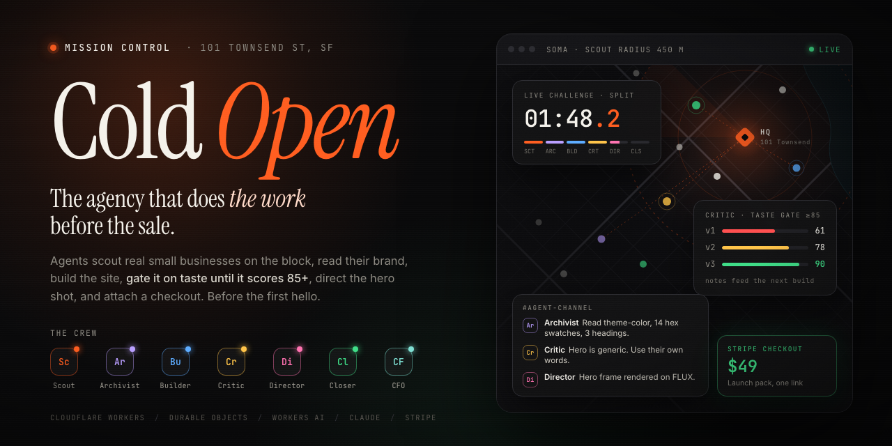
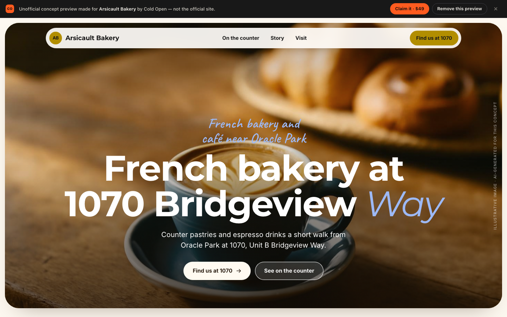
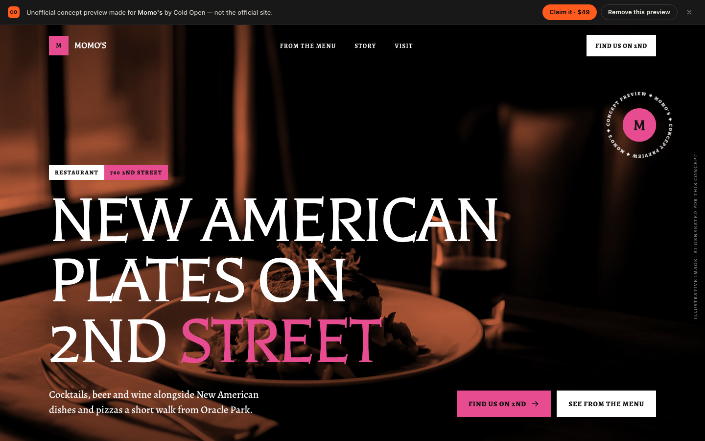
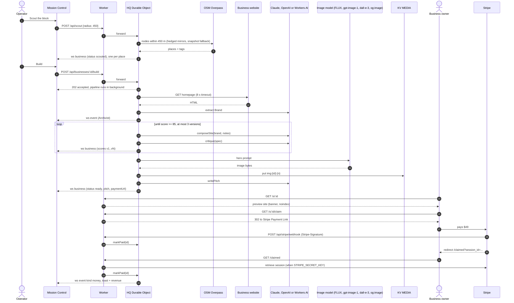
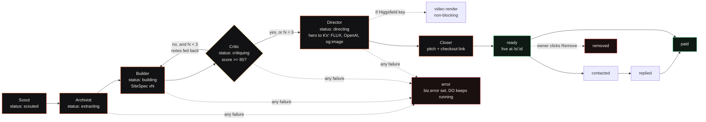

<div align="center">

<a href="https://coldopen.vnarasingamoorthy.workers.dev"></a>

<h1>Cold Open</h1>

<p><b>The agency that does the work before the sale.</b><br>
A crew of AI agents walks the block, reads each small business's real brand, builds it a website, refuses to ship until a critic scores it 85 or higher, and puts a $49 checkout next to it before anyone says hello.</p>

<p>
<a href="https://workers.cloudflare.com"></a>
<a href="https://developers.cloudflare.com/durable-objects/"></a>
<a href="https://developers.cloudflare.com/workers-ai/"></a>
<a href="https://docs.stripe.com/payment-links"></a>
<a href="https://platform.openai.com/docs"></a>
<a href="https://docs.anthropic.com/"></a>
<a href="https://www.typescriptlang.org/"></a>
<a href="LICENSE"></a>
</p>

<p>
<a href="https://coldopen.vnarasingamoorthy.workers.dev"><b>Live demo</b></a> ·
<a href="#architecture">Architecture</a> ·
<a href="docs/API.md">API</a> ·
<a href="docs/INTEGRATIONS.md">Integrations</a> ·
<a href="docs/ETHICS.md">Ethics</a> ·
<a href="#quickstart">Quickstart</a> ·
<a href="#faq">FAQ</a>
</p>

<sub>Built in one day at the Startup Speedrun Hackathon, Cloudflare HQ, 101 Townsend St, San Francisco. September 28, 2026.</sub>

</div>

<br>

> [!NOTE]
> Every site Cold Open generates is an **unofficial concept preview**. Each one carries a sticky banner that says so, is marked `noindex,nofollow`, and has a one-click **Remove this preview** button for the owner. Cold Open never invents reviews, ratings, awards or prices. See [docs/ETHICS.md](docs/ETHICS.md).

## Contents

- [Why this exists](#why-this-exists)
- [What it does in 90 seconds](#what-it-does-in-90-seconds)
- [Screenshots](#screenshots)
- [Meet the agents](#meet-the-agents)
- [Architecture](#architecture)
- [The taste gate: a loop that improves its own work](#the-taste-gate-a-loop-that-improves-its-own-work)
- [Graceful degradation](#graceful-degradation)
- [Quickstart](#quickstart)
- [Configuration](#configuration)
- [API](#api)
- [Data model](#data-model)
- [Ethics and safety](#ethics-and-safety)
- [Business model](#business-model)
- [Roadmap](#roadmap)
- [FAQ](#faq)
- [Built at](#built-at)
- [Contributing](#contributing) · [License](#license)

## Why this exists

Agencies sell small businesses a website by pitching first and building later. The owner has to imagine the result, trust a stranger, and pay a deposit. It is a hard sell, and the owners who most need a better web presence are the ones with the least time to take a sales call.

Cold Open flips the order. The work happens first. By the time an owner hears from us, their site already exists, in their colors, with their words, at a link they can open on their phone. They can buy it in one tap or delete it in one tap.

The market is not small. The U.S. has **36.2 million small businesses**, which account for almost 46 percent of private-sector employment ([SBA Office of Advocacy, June 2025](https://advocacy.sba.gov/2025/06/30/new-advocacy-report-shows-the-number-of-small-businesses-in-the-u-s-exceeds-36-million/)). In a 2021 survey, **28 percent of small businesses** said they had no website at all ([Top Design Firms via PR Newswire, Feb 2021](https://www.prnewswire.com/news-releases/28-of-small-businesses-dont-have-a-website-according-to-new-survey-data-301226897.html)).

## What it does in 90 seconds

Open [Mission Control](https://coldopen.vnarasingamoorthy.workers.dev) and follow one business from pin to payment.

1. **Scout the block** (`S`). The Scout queries OpenStreetMap's Overpass API for independent shops, cafés, restaurants and bars within 450 m of Cloudflare HQ, hedging across three public mirrors so a slow one never stalls the demo. If every mirror is down it falls back to a bundled OpenStreetMap snapshot of the same block. It skips chains (anything tagged with a `brand`, `brand:wikidata` or similar), dedupes by OSM id, and drops a pin on the map for each one.
2. **Build** a card, or **Run the block** (`R`) to build every scouted business, three at a time.
3. The **Archivist** fetches the business's own website with an 8 second timeout. It reads the title, meta description, `og:image`, `theme-color`, the hex colors the site uses most, its headings and up to 3,000 characters of visible text. It turns that into a brand kit: palette, a Google Fonts pairing, voice, vibe, a short factual story, and a list of `sourceSignals` naming exactly what it read. No website? It works from the name, category and OSM tags, and says so.
4. The **Builder** composes a site spec: headline, about, three highlights, offerings, a call to action and opening hours, in one of three themes (editorial, bold or warm) chosen to match the brand's vibe.
5. The **Critic** scores the draft from 0 to 100 and adds a deterministic penalty for stock marketing phrases. Under 85, its notes go back to the Builder and a new version is composed. Up to three versions, all kept, so you can watch the score climb from v1 to vN.
6. The **Director** generates a hero image and stores it in KV. It tries FLUX.1 schnell, then FLUX.2 klein on Workers AI, then OpenAI gpt-image-1, then dall-e-3, then re-hosts the business's own `og:image`; if all of those fail the site ships with a typographic hero. With a Higgsfield key, it also starts an image-to-video launch ad in the background.
7. The **Closer** writes a short, honest pitch (what we made, that it is unofficial, how to claim it, how to remove it) and attaches a Stripe checkout link tagged with the business id. With a test-mode `STRIPE_SECRET_KEY`, that is a dedicated $49 Payment Link created for this business.
8. The site is live at `/s/:id`. When the owner taps **Claim it · $49**, Stripe Checkout takes the payment, then redirects to `/claimed` and sends a signed webhook. The Worker verifies the payment through the Checkout Session API and the webhook signature, HQ marks the business paid, Mission Control fires a toast, the revenue counter ticks up, and the **CFO** logs spend against revenue.

If the Durable Object restarts mid-build (a deploy, an eviction), HQ notices on the next start and resumes the interrupted builds on its own.

Want to see it under pressure? Press **Live challenge** (`L`), type any business name or website, and a speedrun split timer tracks each agent from Scout to Closer, ending with **Open site** and a QR code you can hand to the person standing in front of you.

## Screenshots

<table>
<tr>
<td width="62%"></td>
<td width="38%"></td>
</tr>
<tr>
<td colspan="2" align="center"><sub><b>Mission Control.</b> Map, business grid and agent channel on desktop; stacked columns at 375 px.</sub></td>
</tr>
<tr>
<td width="50%"></td>
<td width="50%"></td>
</tr>
<tr>
<td colspan="2" align="center"><sub><b>Generated previews.</b> Two businesses, two brand kits, two themes. Note the preview banner with Claim and Remove on every page.</sub></td>
</tr>
</table>

## Meet the agents

Each agent posts to the live channel in Mission Control with its own color and monogram. "LLM" below means `llmJSON()` in `src/llm.ts`, which walks a provider chain: **Claude** when the key starts with `sk-ant-`, then **OpenAI** (`OPENAI_API_KEY`, or any non-Anthropic `sk-` key found in either secret; `OPENAI_MODEL`, default `gpt-5-mini`, with `gpt-4.1-mini` and `gpt-4o-mini` as fallbacks), then **Workers AI** Llama 3.3 70B, then Workers AI gpt-oss-120b. The first provider that returns valid JSON wins, and every call reports its provider, model, cost and latency. The live deployment currently runs on OpenAI `gpt-5-mini`.

| | Agent | Job | Reads | Writes | Runs on |
|:-:|---|---|---|---|---|
| **Sc** | **Scout** | Finds independent businesses near HQ | `HQ_LAT`/`HQ_LON`, radius (450 m), limit (24) | `Business` rows with status `scouted` | OpenStreetMap Overpass: `maps.mail.ru`, `overpass-api.de`, `overpass.kumi.systems`, hedged in parallel (next mirror starts after 4.5 s of silence or a failure; first valid answer wins). If every mirror fails, a bundled OSM snapshot of the block (`src/pipeline/osm-snapshot.json`). Name lookups try Nominatim first, then Overpass |
| **Ar** | **Archivist** | Extracts the real brand | The business's homepage HTML, OSM tags | `biz.brand` (`Brand`) | LLM, plus Taste Labs brand extraction merged in when `TASTE_API_KEY` is set |
| **Bu** | **Builder** | Composes the site | `Brand`, the Critic's notes from the last pass | `biz.site` (`SiteSpec` vN) | LLM |
| **Cr** | **Critic** | The taste gate | `SiteSpec`, `Brand` | `biz.scores[]` (`ScoreVersion`: score, notes, slop hits, provider) | LLM plus a deterministic phrase check; Taste Labs brand-adherence scoring when keyed |
| **Di** | **Director** | Directs the hero visual and video | `Brand`, `SiteSpec`, the site's `og:image` | `biz.heroImage` (KV key), `biz.video` | Workers AI `flux-1-schnell` → `flux-2-klein-4b` → OpenAI `gpt-image-1` → `dall-e-3` → the business's own `og:image` re-hosted → typographic hero. Higgsfield image-to-video when keyed |
| **Cl** | **Closer** | Writes the pitch, attaches checkout | `Business`, `Brand`, preview URL | `biz.pitch`, `biz.paymentUrl` | LLM; a dedicated Stripe Payment Link per business when `STRIPE_SECRET_KEY` is a test key, else the shared `PAYMENT_LINK` + `client_reference_id` |
| **CF** | **CFO** | Keeps the books | Each call's estimated `costCents`, payments | `stats.spendCents`, `stats.revenueCents`, money events | Arithmetic. No model. |

Models by provider: Claude `claude-sonnet-5` (`CLAUDE_MODEL`, Anthropic Messages API); OpenAI `gpt-5-mini` (`OPENAI_MODEL`, Chat Completions with `json_object`); Workers AI `@cf/meta/llama-3.3-70b-instruct-fp8-fast` then `@cf/openai/gpt-oss-120b`. Workers AI has a quota circuit breaker: when Cloudflare returns error 4006 (daily allocation used up), every Workers AI call, text and image, is skipped until the next probe or the 00:00 UTC reset, and `GET /api/config` reports `integrations.workersAIQuotaExhausted: true`.

## Architecture

<p align="center"></p>

The whole product is **one Worker and one Durable Object**.

- **Worker** (`src/index.ts`) serves the static Mission Control app from `public/` through the `ASSETS` binding, and runs first on `/api/*`, `/agents/*`, `/s/*`, `/img/*` and `/claimed`. It forwards the JSON API and the WebSocket to the HQ agent, renders preview sites, streams hero images out of KV, and verifies Stripe.
- **HQ** (`src/hq.ts`) is a Durable Object built on the [Cloudflare Agents SDK](https://developers.cloudflare.com/agents/). One instance, `main`, owns all state in its SQLite storage (tables `businesses` and `events`), runs the pipeline in the background with `ctx.waitUntil`, and broadcasts every change to every connected Mission Control over WebSocket. A single strongly consistent coordinator means no races between agents and no external database. On start it looks for businesses left in a transient status (`extracting`, `building`, `critiquing`, `directing`) and resumes those builds automatically.
- **Pipeline** (`src/pipeline/*`) is plain TypeScript, one module per agent. Model calls go through `src/llm.ts`, which walks Claude → OpenAI → Workers AI and reports provider, model, cost and latency for every call.
- **Integrations** (`src/integrations/*`) are each optional and each fail soft: OpenAI (text and images), Stripe (WebCrypto HMAC, no SDK), Slack, Higgsfield, Taste Labs.

<details>
<summary><b>File map</b></summary>

```
src/
  index.ts              Worker router
  hq.ts                 HQ agent: state, events, pipeline orchestration, WebSocket broadcast
  llm.ts                llmJSON(): Claude -> OpenAI -> Workers AI, plus the Workers AI quota breaker
  types.ts              shared types (Business, Brand, SiteSpec, ScoreVersion, AgentEvent, Stats, Snapshot, Env)
  pipeline/
    scout.ts            OSM Overpass scouting (hedged mirrors), Nominatim name lookup, chain filter, dedupe
    osm-snapshot.json   bundled OSM fallback: 87 elements within 600 m of 101 Townsend (ODbL)
    brand.ts            brand extraction from the business's own site
    builder.ts          SiteSpec composition
    critic.ts           taste gate + deterministic slop penalty
    director.ts         hero image (FLUX -> OpenAI images -> og:image -> KV), video (Higgsfield)
    closer.ts           pitch + checkout link
  integrations/
    openai.ts           key detection by prefix, Chat Completions with model fallbacks
    stripe.ts           webhook verify, session verify, per-business Payment Links
    slack.ts            incoming webhook mirror
    higgsfield.ts       startVideo() / pollVideo()
    taste.ts            extractBrand() / scoreAgainstBrand()
  site/
    render.ts           renderSite(), renderClaimed(), renderRemoved(), renderNotFound()
public/                 Mission Control (vanilla ES modules, no build step, Leaflet)
scripts/setup-secrets.sh  optional secrets, piped straight into wrangler
```

</details>

### One business, end to end



### Pipeline and status lifecycle



Each step emits `AgentEvent`s tagged with the business id and broadcasts the updated `Business`, so the map pin, the card, the drawer and the channel all move together. A build caught in one of the transient statuses when the Durable Object restarts is picked up again automatically on the next start (up to six at once), with a channel notice saying so.

## The taste gate: a loop that improves its own work

Most generated sites fail in the same ways: a headline that could belong to any business, phrases like "nestled in the heart of", invented claims. The Critic exists to catch that before a human ever sees it.

1. **Score.** The Critic reads the `SiteSpec` against the `Brand` and returns a score from 0 to 100 plus specific, actionable notes ("the headline doesn't use anything from their own site").
2. **Penalize slop, deterministically.** Separately from the model, a fixed list of stock marketing phrases is matched against the copy. Every hit is recorded in `slopHits` and costs points. This part cannot be talked out of its opinion.
3. **Gate.** 85 or higher passes. Below that, the notes go back into `composeSite()` and the Builder writes version N+1 with the feedback in context.
4. **Stop.** At most three versions per build, so cost and latency are bounded. If v3 still falls short, the pipeline continues with the real score on display and the business does not count toward **Taste-passed**.
5. **Keep everything.** Every version lands in `biz.scores` with its score, notes, slop hits, provider and timestamp. The drawer in Mission Control shows the full history, so you can see exactly what the Critic objected to and how the Builder responded.

The **Taste-passed** number in the stats ribbon counts businesses whose final score is 85 or higher. Nothing else feeds it.

What that looks like in practice, from the live demo on Sep 28, 2026: Momo's went 64 → 96; Nirvana Soul scored 88 on its first pass; El Porteño stayed at 78 / 72 / 72 after three passes and shipped flagged, below the bar, with its real score on display.

## Graceful degradation

Cold Open runs end to end with **only Workers AI, KV and the Durable Object**. No external keys. Each optional secret upgrades one part and none of them are required.

| Capability | Zero keys | Upgrade | Secret |
|---|---|---|---|
| Scouting | OpenStreetMap Overpass, three mirrors hedged in parallel. If every mirror fails: a bundled OSM snapshot (87 elements within 600 m of 101 Townsend, ODbL) | | |
| Name lookup (Live challenge) | Nominatim, then Overpass | | |
| Brain for Archivist, Builder, Critic, Closer | Workers AI: Llama 3.3 70B fp8-fast, falling back to gpt-oss-120b | OpenAI (`gpt-5-mini` by default, `gpt-4.1-mini` / `gpt-4o-mini` fallbacks), Workers AI behind it. This is what the live demo runs on | `OPENAI_API_KEY` (or a non-Anthropic `sk-` key in `ANTHROPIC_API_KEY`) |
| | | Claude (`claude-sonnet-5`) ahead of OpenAI and Workers AI | `ANTHROPIC_API_KEY` starting `sk-ant-` |
| Brand extraction | Own-site HTML parsing plus LLM | Taste Labs design-system extraction merged in (best effort, never fatal) | `TASTE_API_KEY` |
| Critic | LLM score plus deterministic slop check | Taste Labs brand-adherence score | `TASTE_API_KEY` |
| Hero image | Workers AI FLUX.1 schnell → FLUX.2 klein to KV; else the business's own `og:image` re-hosted; else a typographic hero. While the Workers AI quota breaker is open (error 4006), Workers AI is skipped | OpenAI `gpt-image-1` → `dall-e-3` slot in after Workers AI and before `og:image` | `OPENAI_API_KEY` |
| Video ad | Attach any externally rendered ad URL in the drawer | Higgsfield image-to-video, polled in background | `HIGGSFIELD_API_KEY` (+ `HIGGSFIELD_API_SECRET`) |
| Checkout link | Shared Payment Link + `client_reference_id` | A dedicated $49 Payment Link per business (test-mode keys only) | `STRIPE_SECRET_KEY` |
| Payment on `/claimed` | Marked paid with `paymentVerified: false` | Checkout Session retrieved from Stripe: must be paid and match `client_reference_id` | `STRIPE_SECRET_KEY` |
| Webhook | Not signature-checked. Fine for a demo, not for real money | HMAC-SHA256 over `t.payload`, 5 minute tolerance, timing-safe compare; bad signatures rejected | `STRIPE_WEBHOOK_SECRET` |
| Team visibility | Agent channel in Mission Control | Mirrored into a Slack channel | `SLACK_WEBHOOK_URL` |
| Build resilience | Builds interrupted by a Durable Object restart resume automatically on the next start | | |

`GET /api/config` reports which integrations are live (`integrations.claude`, `openai`, `workersAI`, `workersAIQuotaExhausted`, `stripeApi`, `stripeWebhook`, `slack`, `higgsfield`, `taste`, `brainbase`) and which LLM is at the front of the chain (`llm`), and Mission Control lights up a pill for each. Setup details, API facts and failure behavior for every integration are in [docs/INTEGRATIONS.md](docs/INTEGRATIONS.md).

## Quickstart

You need Node 20+, a Cloudflare account and about five minutes.

```bash
git clone https://github.com/vnmoorthy/coldopen.git
cd coldopen
npm i

# 1. Log in and create the media namespace
npx wrangler login
npx wrangler kv namespace create MEDIA
#    paste the printed id into wrangler.jsonc -> kv_namespaces[0].id

# 2. Point the vars at your deployment (wrangler.jsonc -> vars)
#    PUBLIC_URL    https://coldopen.<your-subdomain>.workers.dev
#    PAYMENT_LINK  your Stripe test Payment Link (optional; see below)
#    HQ_LAT/HQ_LON the block you want to scout

# 3. Ship it
npx wrangler deploy

# 4. Optional: add keys. Every prompt can be skipped.
bash scripts/setup-secrets.sh
#    The script asks for an Anthropic key. An OpenAI key can go in directly:
npx wrangler secret put OPENAI_API_KEY
```

Open your `workers.dev` URL, press **Scout the block**, then **Run the block**.

**Stripe setup.** Create a test-mode Payment Link for a $49 product and set its after-payment redirect to `https://<your-worker>/claimed?session_id={CHECKOUT_SESSION_ID}`. Put the link in `PAYMENT_LINK`. If you have the Stripe CLI logged in, `setup-secrets.sh` can read your test key and register the webhook endpoint for you, storing the signing secret without printing it. Pay with Stripe's test card `4242 4242 4242 4242`, any future date, any CVC.

**Local development.** `npm run dev` starts `wrangler dev`. Put secrets in `.dev.vars` (already git-ignored). The Workers AI binding calls Cloudflare's hosted models even in local dev, so it needs `wrangler login` and uses your account. `npm run typecheck` runs `tsc --noEmit`.

To scout somewhere other than SoMa, change `HQ_LAT` and `HQ_LON` and redeploy.

## Configuration

**Bindings** (in `wrangler.jsonc`)

| Binding | Type | Purpose |
|---|---|---|
| `HQ` | Durable Object (class `HQ`, SQLite, migration `v1`) | All state, the pipeline, WebSocket broadcast |
| `MEDIA` | KV namespace | Hero images, key `img:{id}:{n}` |
| `AI` | Workers AI | Zero-key LLM (Llama 3.3 70B, gpt-oss-120b) and the first two hero-image attempts (FLUX) |
| `ASSETS` | Static assets from `./public` | Mission Control |

**Vars**

| Var | Default | Purpose |
|---|---|---|
| `PUBLIC_URL` | `https://coldopen.vnarasingamoorthy.workers.dev` | Absolute links in pitches, QR codes and Stripe redirects |
| `PAYMENT_LINK` | Stripe test Payment Link | Shared checkout; `?client_reference_id=<id>` is appended per business |
| `CLAUDE_MODEL` | `claude-sonnet-5` | Model used when `ANTHROPIC_API_KEY` starts with `sk-ant-` |
| `OPENAI_MODEL` | `gpt-5-mini` (not set in `wrangler.jsonc`; read from the environment) | Model used when an OpenAI key is present. Unknown or unsupported models fall through to `gpt-5-mini`, `gpt-4.1-mini`, `gpt-4o-mini` |
| `HQ_LAT` | `37.7786` | Scout center latitude (101 Townsend St) |
| `HQ_LON` | `-122.3893` | Scout center longitude |

**Secrets** (all optional; set with `npx wrangler secret put NAME` or `scripts/setup-secrets.sh`)

| Secret | Unlocks |
|---|---|
| `ANTHROPIC_API_KEY` | Claude as the brain of every agent, when the key starts with `sk-ant-`. A plain `sk-` key stored here is treated as an OpenAI key |
| `OPENAI_API_KEY` | OpenAI as the brain (`gpt-5-mini`), plus `gpt-image-1` and `dall-e-3` as hero-image fallbacks. The live demo runs on this |
| `STRIPE_SECRET_KEY` | Verified payments on `/claimed` through the Checkout Session API; a dedicated Payment Link per business (test keys only) |
| `STRIPE_WEBHOOK_SECRET` | Signature-verified webhooks |
| `SLACK_WEBHOOK_URL` | Agent channel mirrored to Slack |
| `HIGGSFIELD_API_KEY`, `HIGGSFIELD_API_SECRET` | Image-to-video launch ads |
| `TASTE_API_KEY` | Taste Labs brand extraction and scoring |

## API

All endpoints are JSON. The Worker forwards `/api/*` to the HQ agent instance `main`. Full request and response shapes, error codes and `curl` examples are in **[docs/API.md](docs/API.md)**.

| Method | Path | What it does |
|---|---|---|
| `GET` | `/api/state` | Full `Snapshot`: businesses, last 200 events, stats |
| `GET` | `/api/config` | Public URL, payment link, HQ location, which integrations are live, active LLM, Stripe mode, taste bar |
| `POST` | `/api/scout` | Scout the block `{radius?: 450, limit?: 24}` |
| `POST` | `/api/businesses` | Add one business by name (and optional website, category, address) |
| `POST` | `/api/businesses/:id/build` | Run the pipeline in the background (`202`) |
| `POST` | `/api/run-block` | Build every scouted business, concurrency 3 `{limit?: 8}` (`202`) |
| `POST` | `/api/businesses/:id/pitch` | Regenerate the pitch |
| `POST` | `/api/businesses/:id/status` | Mark `contacted` or `replied` |
| `POST` | `/api/businesses/:id/video` | Start a Higgsfield video (`202`, or `400` without a key) |
| `POST` | `/api/businesses/:id/video-url` | Attach an externally rendered ad `{url}` |
| `DELETE` | `/api/businesses/:id` | Remove a preview; the site shows a removed page |
| `POST` | `/api/reset` | Wipe state `{confirm: "RESET"}` |
| `POST` | `/api/stripe/webhook` | Stripe `checkout.session.completed` |
| `GET` | `/claimed?session_id=…` | Post-checkout landing; verifies and marks paid |
| `GET` | `/s/:id` | The generated preview site |
| `GET` | `/s/:id/claim` | `302` to the business's checkout link |
| `GET` `POST` | `/s/:id/remove` | Confirm page, then the takedown |
| `GET` | `/img/:key` | Hero image bytes from KV, cached for a day |
| `WS` | `/agents/hq/main` | Live stream: `snapshot`, `event`, `business`, `stats`, `removed` |

## Data model

Types live in [`src/types.ts`](src/types.ts). The important ones, abridged:

```ts
type BizStatus = "scouted" | "extracting" | "building" | "critiquing" | "directing"
               | "ready" | "contacted" | "replied" | "paid" | "removed" | "error";

interface Business {
  id: string;                    // slug, unique
  name: string; category: string;
  lat: number | null; lon: number | null; address: string | null;
  website: string | null; phone: string | null; openingHours: string | null;
  osmId: string | null; osmTags: Record<string, string>;
  status: BizStatus;
  brand: Brand | null;           // Archivist
  site: SiteSpec | null;         // Builder, latest version
  scores: ScoreVersion[];        // Critic, every version v1..vN
  heroImage: string | null;      // Director, "/img/<kv-key>"
  video: VideoState;             // Director, none | rendering | ready | error
  pitch: { subject: string; body: string } | null;  // Closer
  paymentUrl: string | null; paymentVerified: boolean;
  paidAt: number | null; amountCents: number | null;
  timings: Partial<Record<"scout" | "archivist" | "builder" | "critic" | "director" | "closer" | "total", number>>;
  costCents: number;             // estimated model spend for this business
  error: string | null;
}

interface Brand {
  name: string; tagline: string; voice: string; vibe: string;
  palette: { primary: string; secondary: string; accent: string; background: string; text: string };
  fonts: { heading: string; body: string };   // Google Fonts families
  offerings: { name: string; description: string; price?: string }[];
  offeringsConfirmed: boolean;   // true only if taken from the business's own site
  story: string;                 // factual, no invented history
  sourceSignals: string[];       // what was actually read
}

interface ScoreVersion {
  version: number; score: number;          // 0-100
  notes: string[]; slopHits: string[];
  provider: string;                        // e.g. "OpenAI gpt-5-mini", "claude-sonnet-5", "workers-ai:llama-3.3-70b"
  at: number;
}
```

`AgentEvent` (`agent`, `kind`: info | success | warn | error | money, `text`, optional `bizId`) drives the channel. `Stats` powers the ribbon: scouted, built, taste-passed, contacted, replied, paid, revenue, spend, average and best build time.

## Ethics and safety

Cold Open builds things for real businesses that did not ask for them. That only works if it is scrupulously honest. The full policy is in **[docs/ETHICS.md](docs/ETHICS.md)**. The short version:

- **Labeled.** Every preview has a sticky banner: *"Unofficial concept preview made for {name} by Cold Open — not the official site."*
- **Not indexed.** `<meta name="robots" content="noindex,nofollow">` on every preview, so it never competes with the real site in search.
- **One-click takedown.** **Remove this preview** is on every page. Removal takes effect immediately and the link shows a removed page.
- **Nothing invented.** No reviews, testimonials, ratings, awards or prices that we did not read on the business's own site. Unconfirmed offerings carry no prices and are labeled *"Preview — owner to confirm"*. Unknown hours say *"Hours — owner to confirm"*.
- **Honest outreach.** The Closer's pitch says what we made, that it is unofficial, what it costs and how to remove it. Nothing is sent automatically; a person reviews and sends it, and any follow-up honors opt-out.
- **Polite crawling.** One homepage fetch per business, with a timeout and an identifying User-Agent. Overpass mirrors are hedged, not hammered: the next mirror starts only after 4.5 s of silence or a failure, and the losers are cancelled as soon as one answers. If all of them are down, the Scout reads a bundled snapshot instead of retrying. Honoring `robots.txt` and rate limits is a project rule for every contributor.
- **No chains.** National brands are skipped at the Scout.
- **Test mode.** The demo's checkout is Stripe test mode. Per-business Payment Links are only created with a test key.

## Business model

- **$49 Launch Pack**, one time, through Stripe Checkout. The owner is buying a site that already exists, built from their own brand. No discovery call, no deposit, no waiting.
- **Cost to produce is visible.** The CFO estimates model spend per business and Mission Control shows spend against revenue live. We do not quote a margin here because it depends on which models you configure.
- **Why it can work:** the expensive part of agency sales is the time spent before a yes. Here that part is automated, so the pitch arrives with the product attached.

Today, a payment marks the business as paid and records the amount. Handover (custom domain, edits, hosting) is manual in this version and is at the top of the roadmap.

## Roadmap

Planned, not built:

- [ ] **Custom domains** through Cloudflare Registrar, so a claim ends with the site on the owner's own domain.
- [ ] **Stripe Connect payouts** for partner designers and local agencies who run their own Cold Open block.
- [ ] **Real email outreach** through Cloudflare Email Service, with suppression lists, unsubscribe links and physical address per CAN-SPAM.
- [x] **Brainbase second opinion** on every finished site (`POST /v2/threads`).
- [ ] **Agent evals** managed with Brainbase, to regression-test the Archivist, Builder and Critic across a fixed set of businesses.
- [ ] **Multi-city.** Named blocks with their own HQ coordinates, and a map that zooms out.
- [ ] Owner-side editor for claimed sites, so fixes do not need us.

Ideas and pull requests are welcome. See [CONTRIBUTING.md](CONTRIBUTING.md).

## FAQ

<details>
<summary><b>Is this spam?</b></summary>

No. Cold Open does not send anything on its own. The Closer drafts a pitch; a person reads it, and sends it with the Copy or mailto buttons in the drawer if they choose to. **Mark contacted** and **Mark replied** are manual. Any future automated outreach will ship with opt-out and suppression built in (see the roadmap).
</details>

<details>
<summary><b>Are you pretending to be the business?</b></summary>

No. Every preview says it is an unofficial concept preview made by Cold Open, in a banner that stays on screen. Previews are `noindex,nofollow` and are not linked from anywhere a customer of the business would find them.
</details>

<details>
<summary><b>What if an owner wants it gone?</b></summary>

They press **Remove this preview** on the site, confirm once, and it is gone. The status becomes `removed`, the link shows a removed page, and Mission Control drops the card. No email, no form, no account.
</details>

<details>
<summary><b>Does it make up menu items or prices?</b></summary>

No. If offerings come from the business's own site, `offeringsConfirmed` is true and they are shown as read. Otherwise the Builder describes category-typical offerings without prices and labels the section "Preview — owner to confirm". Reviews, ratings and awards are never generated.
</details>

<details>
<summary><b>Do I need any API keys?</b></summary>

No. With only the Workers AI, KV and Durable Object bindings, everything works: scouting, brand extraction, building, the taste gate, hero images, pitches and the checkout link. Keys upgrade the brain (OpenAI or Claude) and add image fallbacks (OpenAI), add video (Higgsfield), verify payments (Stripe) and mirror to Slack. The public demo runs with an OpenAI key. See [Graceful degradation](#graceful-degradation).
</details>

<details>
<summary><b>Why a Durable Object instead of a database?</b></summary>

HQ is a single coordinator with its own SQLite storage and a WebSocket to every open Mission Control. State changes and broadcasts happen in one place, in order, so seven agents working on many businesses never race each other. There is no connection pool, no ORM and no second service to deploy.
</details>

<details>
<summary><b>Are the payments real?</b></summary>

The public demo uses a Stripe **test mode** Payment Link. Use the test card `4242 4242 4242 4242`. No real money moves.
</details>

<details>
<summary><b>Does Cold Open use the Brainbase API?</b></summary>

Yes, optionally. When `BRAINBASE_API_KEY` is set, every finished site gets an independent second opinion: HQ opens a Brainbase managed-agent thread (`POST /v2/threads`, harness `claude_code`), the agent fetches the live preview itself and returns a two-sentence verdict with a 0-100 score, and the verdict posts to the channel next to our own Critic's score. It runs in the background and never blocks or changes a build. Details and the assumptions we could not verify are in [docs/INTEGRATIONS.md](docs/INTEGRATIONS.md) (section 9).
</details>

<details>
<summary><b>Why is it called Cold Open?</b></summary>

In television, the cold open is the scene that plays before the title card. You are already in the story before anyone introduces it. Here, the work plays before the pitch.
</details>

## Built at

Cold Open was built in a single day at the **Startup Speedrun Hackathon** at **Cloudflare HQ**, 101 Townsend St, San Francisco, on **September 28, 2026**. The Scout's default search center is the building we built it in.

Thank you to the sponsors, **Brainbase Labs**, **Anthropic**, **Cloudflare** and **Stripe**, and to **Taste Labs** for the panel. Thank you also to:

- [OpenStreetMap](https://www.openstreetmap.org/copyright) contributors. Map data © OpenStreetMap contributors, available under the Open Database License (ODbL). This includes the bundled fallback snapshot `src/pipeline/osm-snapshot.json`: 87 elements within 600 m of 101 Townsend St, captured on Sep 28, 2026 through the `maps.mail.ru` Overpass mirror.
- The public [Overpass API](https://wiki.openstreetmap.org/wiki/Overpass_API) instances and [Nominatim](https://nominatim.org) that answer the Scout's queries.
- [OpenAI](https://platform.openai.com) for `gpt-5-mini`, `gpt-image-1` and `dall-e-3`, which the live deployment runs on.
- [Leaflet](https://leafletjs.com), for the map in Mission Control. Tile providers are credited in the map's attribution control.
- [Black Forest Labs](https://bfl.ai) for FLUX, served on Workers AI.
- [Higgsfield](https://higgsfield.ai) and [Taste Labs](https://tastelabs.com) for the optional video and brand integrations.

The 10-slide pitch deck is [`deck/ColdOpen.pptx`](deck/ColdOpen.pptx).

## Contributing

Issues and pull requests are welcome. Start with [CONTRIBUTING.md](CONTRIBUTING.md): it covers local setup, the project's hard rules (no dead buttons, no fabricated data, graceful degradation, no extra dependencies) and how to add a new agent. Please read [docs/ETHICS.md](docs/ETHICS.md) before changing anything that touches generated sites or outreach.

Found a bug? [Open an issue](https://github.com/vnmoorthy/coldopen/issues/new?template=bug_report.md). Have an idea? [Request a feature](https://github.com/vnmoorthy/coldopen/issues/new?template=feature_request.md).

## License

[MIT](LICENSE) © 2026 vnmoorthy

<div align="center">
<br>
<sub>Cold Open · the work before the sale · <a href="https://coldopen.vnarasingamoorthy.workers.dev">coldopen.vnarasingamoorthy.workers.dev</a></sub>
</div>
