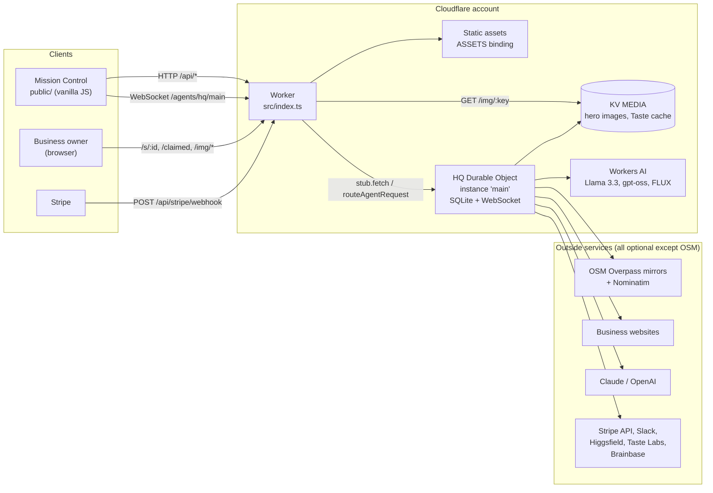
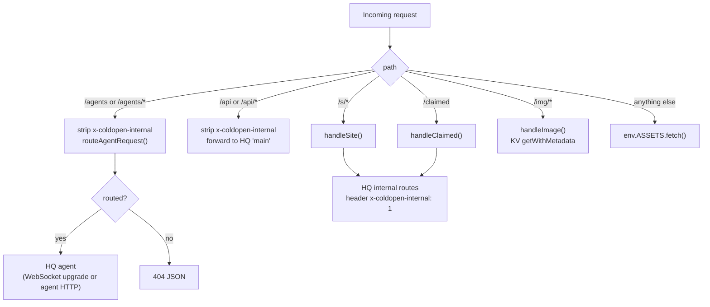
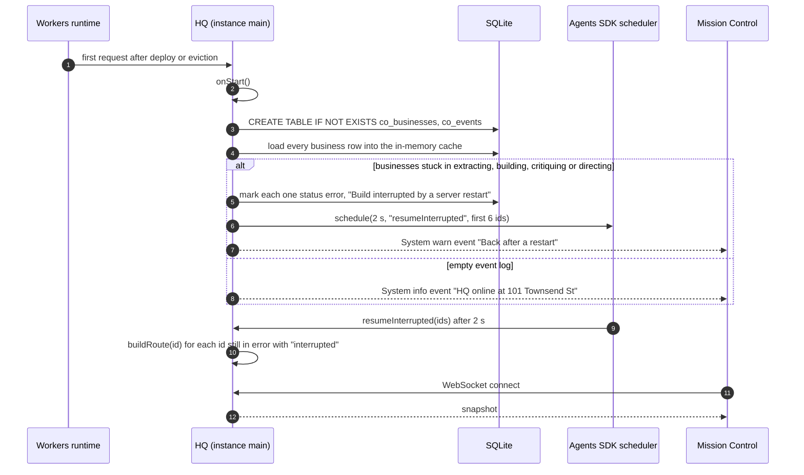
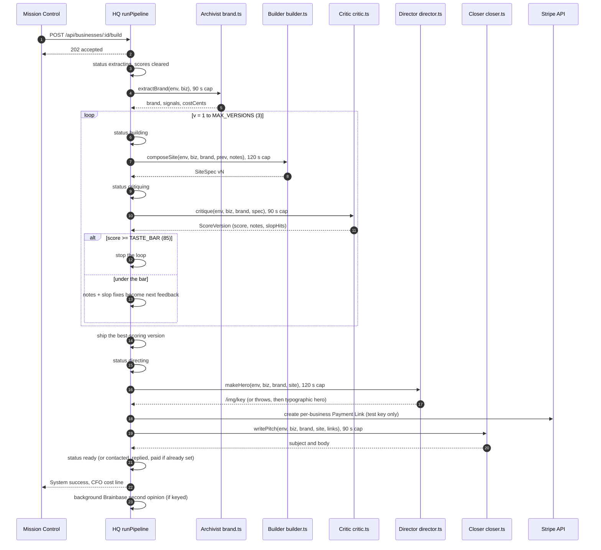
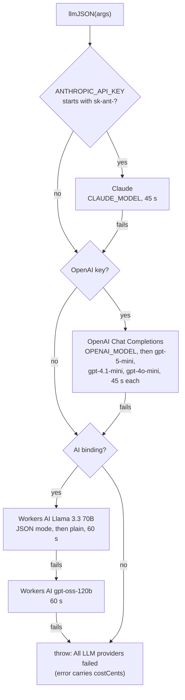
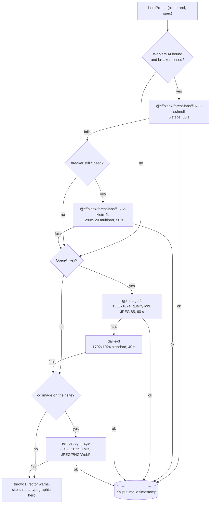
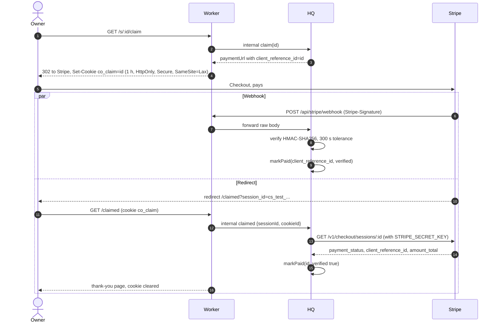
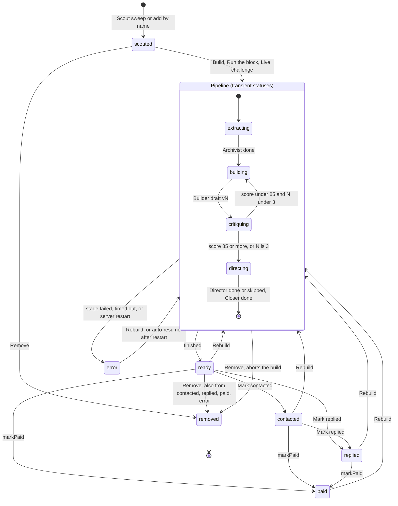

# Architecture

This is a code-level walkthrough of Cold Open: how a request is routed, how the single Durable Object that runs everything starts, recovers and schedules work, what it stores, what it broadcasts, and what each pipeline stage does when things go right and when they go wrong.

Every number in this document (timeouts, limits, prices) is a constant in the source. File and line references point at the code on the main branch; if you change a constant, change it here too.

- [1. The shape of the system](#1-the-shape-of-the-system)
- [2. Request routing (`src/index.ts`)](#2-request-routing-srcindexts)
- [3. The HQ Durable Object](#3-the-hq-durable-object)
- [4. State and the SQLite schema](#4-state-and-the-sqlite-schema)
- [5. The WebSocket protocol](#5-the-websocket-protocol)
- [6. The pipeline, stage by stage](#6-the-pipeline-stage-by-stage)
- [7. The LLM chain and cost accounting](#7-the-llm-chain-and-cost-accounting)
- [8. The image chain](#8-the-image-chain)
- [9. Payment attribution](#9-payment-attribution)
- [10. Business status lifecycle](#10-business-status-lifecycle)
- [11. Failure modes](#11-failure-modes)
- [12. Timeouts and limits at a glance](#12-timeouts-and-limits-at-a-glance)

---

## 1. The shape of the system

Cold Open is **one Worker and one Durable Object**. There is no external database, no queue and no second service.



| Piece | File | Responsibility |
|---|---|---|
| Worker | `src/index.ts` | Routing, preview-site HTML, `/claimed`, `/img/:key`, error pages. Holds no state. |
| HQ | `src/hq.ts` | All state (SQLite), every `/api/*` route, pipeline orchestration, WebSocket broadcast, schedules. |
| LLM chain | `src/llm.ts` | `llmJSON()` (Claude, then OpenAI, then Workers AI), JSON repair, cost estimates, the Workers AI quota breaker. |
| Agents | `src/pipeline/*.ts` | One module per agent. Pure functions of `(env, biz, ...)` that return data; HQ persists and broadcasts. |
| Integrations | `src/integrations/*.ts` | Stripe, Slack, OpenAI, Higgsfield, Taste Labs, Brainbase. Each is optional and fails soft. |
| Renderer | `src/site/render.ts` | Deterministic HTML for preview sites and the Cold Open utility pages. No model calls. |
| Mission Control | `public/` | Static ES modules, no build step. Talks to `/api/*` and the WebSocket. |

Bindings (`wrangler.jsonc`): `HQ` (Durable Object, SQLite class, migration `v1`), `MEDIA` (KV), `AI` (Workers AI), `ASSETS` (static files from `./public`). `assets.run_worker_first` sends `/api/*`, `/s/*`, `/agents/*`, `/claimed` and `/img/*` to the Worker; every other path is served straight from `public/`.

## 2. Request routing (`src/index.ts`)



### Public routes

| Path | Method | Handler | Notes |
|---|---|---|---|
| `/agents/hq/main` | WS upgrade | Agents SDK `routeAgentRequest` | Class `HQ` maps to the `hq` segment; the instance name is always `main`. |
| `/api/*` | any | `forwardApi` → HQ `onRequest` | The Worker deletes the `x-coldopen-internal` header from every public request before forwarding. |
| `/s/:id` | `GET`, `HEAD` | `handleSite` | `id` must match `^[a-z0-9-]{1,80}$` after lowercasing. `GET` adds `?view=1` to the internal call so HQ can log a view. |
| `/s/:id/claim` | `GET` (`HEAD` returns an empty 200) | `handleSite` | `302` to the checkout URL and sets the `co_claim` cookie. `503` page if no checkout URL exists. |
| `/s/:id/remove` | `GET` confirm page, `POST` remove | `handleSite` | Anything else is `405`. |
| `/claimed` | `GET` (`HEAD` returns an empty 200) | `handleClaimed` | Post-checkout landing and payment attribution. |
| `/img/:key` | `GET`, `HEAD` | `handleImage` | Key is URL-decoded, max 512 chars. Content type from KV metadata (`image/*` or `video/*`), else sniffed from magic bytes. `cache-control: public, max-age=86400`. |
| everything else | | `env.ASSETS.fetch` | Mission Control. |

Every HTML response from the Worker carries `cache-control: no-store`, `x-robots-tag: noindex, nofollow`, `referrer-policy: strict-origin-when-cross-origin` and `x-content-type-options: nosniff`. The generated pages also include `<meta name="robots" content="noindex,nofollow">`.

`/s/:id` behavior depends on the business:

| Business state | Response |
|---|---|
| unknown id | `404` styled page |
| `status: removed` | `410` "Removed." page |
| no `site` or no `brand` yet | `200` status page ("preview is on the way") that refreshes every 5 s; for `status: error` it says the build hit a snag and does not refresh |
| has `site` and `brand` | `200` rendered preview (`renderSite`) |

Note that a preview is served as soon as the Builder's first draft exists. During the taste loop, `/s/:id` shows the latest draft; after the loop HQ swaps in the best-scoring version (see [section 6](#6-the-pipeline-stage-by-stage)).

### Internal routes

The Worker talks to HQ through `https://hq.internal/api/_internal/...` with the header `x-coldopen-internal: 1`. HQ answers `404` on any `/api/_internal/*` path without that header, and the Worker strips the header from all public traffic, so these routes are unreachable from outside.

| Internal route | Method | Used by | Does |
|---|---|---|---|
| `/api/_internal/site/:id` | `GET` | `/s/:id`, `/s/:id/remove` | Returns the business. With `?view=1`, logs a throttled view event. |
| `/api/_internal/claim/:id` | `POST` | `/s/:id/claim` | Resolves the checkout URL, logs a throttled "Claim it" event. |
| `/api/_internal/remove/:id` | `POST` | `POST /s/:id/remove` | Owner takedown. |
| `/api/_internal/claimed` | `POST` | `/claimed` | Payment attribution (`{sessionId, cookieId}`). |
| `/api/_internal/pipeline/:id` | `POST` | HQ itself | Runs one pipeline inside its own request (see [runIsolated](#background-work-and-subrequest-budgets)). |

Bot user agents (`bot|crawler|spider|slurp|facebookexternalhit|embedly|preview|unfurl|whatsapp|telegram|discord|curl|wget|python-requests|headless`) are not logged as views or claims. View events are throttled to one per business per 45 s, claim events to one per 20 s.

### Error handling at the edge

Any exception in the Worker is caught. `/api/*` and `/agents/*` get `500 {"error":"Worker error: ..."}`; every other path gets a branded "Something went wrong" HTML page with status `500`.

## 3. The HQ Durable Object

`HQ` extends the Agents SDK `Agent<Env>`. The Worker always addresses the instance named `main` (`getAgentByName(env.HQ, "main")`), so there is exactly one coordinator for the whole deployment. All HTTP API routes, all state writes and all broadcasts happen inside it, in order.

### Lifecycle



- **`onStart()`** runs `ensureSchema()` and `recoverInterrupted()`.
- **`recoverInterrupted()`** finds every business in a transient status (`extracting`, `building`, `critiquing`, `directing`), persists it as `error` with the message `Build interrupted by a server restart — resuming automatically.`, and schedules `resumeInterrupted` for the first six of them. It uses `this.schedule()` (a durable alarm) rather than `setTimeout`, because a timer dies with an evicted object while an alarm does not. Interrupted builds beyond the first six stay in `error` and need a manual **Rebuild**.
- **`resumeInterrupted({ids})`** re-checks each id (still `error`, error text still mentions "interrupted") and calls `buildRoute(id)`. These resumed builds are not throttled by the block concurrency limit.
- **`onConnect()`** sends a snapshot to the new socket.
- **`onMessage()`** handles `ping` and `snapshot`/`resync` (see [section 5](#5-the-websocket-protocol)).

### In-memory state (lost on eviction)

| Field | Purpose |
|---|---|
| `cache: Map<id, Business>` | Read-through cache of `co_businesses`. Rebuilt from SQLite on first access. |
| `running: Map<id, token>` | The pipeline currently executing for each business and its run token. |
| `queued: Set<id>` | Businesses waiting in a run-block queue. |
| `blockMembers: Set<id>` | Businesses in an active block run: their Slack pings are batched into one block summary and auto-video is skipped. |
| `epoch: number` | Bumped by `POST /api/reset`. In-flight work from an older epoch aborts itself. |
| `runSeq: number` | Source of run tokens. |
| `scouting: boolean` | Only one scout sweep at a time (`409` otherwise). |
| `lastViewEvent`, `lastClaimEvent` | Throttles for view and claim events. |

Module-level state lives in the same isolate and is also lost on eviction: the Workers AI quota breaker and the cost ledger (`src/llm.ts`), the per-business website evidence cache (`src/pipeline/brand.ts`), Taste Labs submission ids (mirrored to KV), Brainbase's last error string and the Slack send queue.

### Epochs and run tokens

Every pipeline run captures the current `epoch` and gets a fresh token from `runSeq`. After every awaited stage it calls `check()`, which throws a private `PipelineAbort` if any of these is true:

- the epoch changed (the board was reset),
- `running.get(id)` is no longer this run's token (the business was removed, which deletes the entry),
- the business no longer exists or its status is `removed`.

`PipelineAbort` is swallowed silently: no error status, no error event. The work already in flight for that stage finishes in the background (timeouts do not cancel the underlying fetches), but its result is discarded.

### Concurrency

- **One run per business.** `runPipeline(id)` returns immediately if `running` already has `id`. `POST /api/businesses/:id/build` answers `202 {alreadyRunning: true}` in that case.
- **Block runs, 3 at a time.** `POST /api/run-block` picks up to `limit` (default 8, max 60) businesses in `scouted` status, nearest to HQ first, and starts `min(3, n)` workers (`BLOCK_CONCURRENCY = 3`) that pull ids from a shared cursor. A queued business that is built, removed or rebuilt by hand before its turn is skipped.
- **Single builds are not queued.** A manual Build or a Live challenge starts immediately, alongside any block run.
- **One scout at a time.** `POST /api/scout` returns `409` while a sweep is running.

### Background work and subrequest budgets

`background(label, fn)` wraps long work so the HTTP response can return first:

1. it takes an Agents SDK `keepAlive()` handle (an alarm heartbeat that keeps the object from being evicted while work is pending),
2. runs `fn`, logging any exception,
3. releases the handle, and
4. registers the whole thing with `ctx.waitUntil`.

Uses: single builds, block runs, Brainbase reviews, Higgsfield video starts and KV purges.

**`runIsolated(id)`** is how a block run executes each build. Instead of calling `runPipeline` directly, HQ sends itself `POST /api/_internal/pipeline/:id`. That request is held open for the whole build, so each build runs in its own invocation with its own subrequest budget. The code comment explains why: a block of 8 builds in one invocation would exceed the Workers Free plan's 50-subrequest limit. If the self-dispatch fails or returns non-2xx, HQ falls back to running the pipeline inline.

**Schedules.** The SDK's `this.schedule(seconds, callbackName, payload)` is used for two callbacks: `resumeInterrupted` (2 s after start) and `pollVideoJob` (every 15 s while a Higgsfield clip renders, 30 s after a transient poll failure). `POST /api/reset` cancels pending `pollVideoJob` schedules.

## 4. State and the SQLite schema

HQ creates two tables on first use:

```sql
CREATE TABLE IF NOT EXISTS co_businesses (
  id         TEXT PRIMARY KEY,   -- slug, e.g. "arsicault-bakery"
  json       TEXT NOT NULL,      -- the whole Business object, JSON-encoded
  created_at INTEGER NOT NULL,   -- ms since epoch
  updated_at INTEGER NOT NULL
);

CREATE TABLE IF NOT EXISTS co_events (
  id     INTEGER PRIMARY KEY AUTOINCREMENT,
  ts     INTEGER NOT NULL,       -- ms since epoch
  biz_id TEXT,                   -- null for board-level events
  json   TEXT NOT NULL           -- AgentEvent without its id
);
```

The Agents SDK also keeps its own `cf_agents_*` tables for schedules and internal bookkeeping. Cold Open never reads or writes them.

**Businesses are documents.** Each row stores the full `Business` (see `src/types.ts`) as one JSON blob. There are no columns per field and no migrations: new optional fields are defaulted when rows are loaded (`video`, `scores`, `timings`, `osmTags`), and corrupt rows are logged and skipped.

**Writes always merge onto the latest copy.** `update(id, change)` reads the current business from the cache, applies a partial object or a function of the current object, stamps `updatedAt`, persists with an upsert, and broadcasts both the business and fresh stats. Stage results are applied with the function form (`update(id, b => ({ costCents: b.costCents + x }))`) so a value computed before an `await` never overwrites a newer one.

**Events are an append-only log.** `emit()` inserts into `co_events` and broadcasts the event. Every 100 inserts, rows older than the newest 1,000 are deleted (`EVENTS_KEPT = 1000`). Snapshots carry the newest 200 (`SNAPSHOT_EVENTS`). `GET /api/events?after=<id>&limit=<1..500>` pages through what is kept.

**Ids are slugs.** `uniqueId(name)` slugifies the name (accents stripped, `&` becomes `and`, max 48 chars) and appends `-2`, `-3`, ... on collision. The slugs `sub`, `new`, `api`, `claim`, `remove`, `img` and `agents` are reserved.

**Stats are derived, never stored.** `computeStats()` recomputes from the business list on every change:

| Stat | Definition |
|---|---|
| `scouted` | businesses not `removed` |
| `built` | not removed and status in `ready`, `contacted`, `replied`, `paid` |
| `tastePassed` | built, and the score of the **shipped** version is ≥ `TASTE_BAR` |
| `contacted`, `replied` | not removed and `contactedAt` / `repliedAt` set |
| `paid` | `paidAt` set (removed businesses included) |
| `revenueCents` | sum of `amountCents` over paid businesses |
| `spendCents` | sum of `costCents` over all businesses, rounded to 4 decimals |
| `avgBuildMs`, `bestBuildMs` | mean and minimum of `timings.total` over businesses that have one |

**KV (`MEDIA`) key layout**

| Key | Written by | Value |
|---|---|---|
| `img:{bizId}:{Date.now()}` | Director | hero image bytes, metadata `{contentType, model, bizId}` |
| `taste:sub:{hash}` | Taste Labs integration | extraction submission id (3-day TTL) |
| `taste:brand:{hash}` | Taste Labs integration | mapped `Partial<Brand>` (7-day TTL) |
| `taste:job:{hash}` | Taste Labs integration | verifier job record (6-hour TTL; the verifier is not called by the pipeline today) |

A superseded hero image is deleted when a rebuild renders a new one. Removing a business purges every `img:{id}:*` key; a reset purges every `img:*` key.

## 5. The WebSocket protocol

Mission Control connects to `wss://<host>/agents/hq/main`. The Agents SDK handles the upgrade; HQ's `onConnect`/`onMessage` handle Cold Open's own messages. All Cold Open frames are JSON text with a `type` field.

### Server to client

| `type` | When | Payload |
|---|---|---|
| `snapshot` | on connect, on client request, after a reset | `{ snapshot: { businesses, events, stats } }` |
| `event` | every `emit()` | `{ event: AgentEvent }` |
| `business` | every insert or update of a non-removed business | `{ business: Business }` |
| `stats` | after every update, and after a scout adds businesses | `{ stats: Stats }` |
| `removed` | a business was removed | `{ id }` |
| `pong` | reply to `ping` | `{ ts }` |

A snapshot contains every non-removed business (oldest first), the newest 200 events (oldest first) and the stats. If the serialized snapshot is longer than 900,000 characters (`WS_SNAPSHOT_MAX_BYTES`), HQ resends it with only the newest 40 events.

The SDK also sends its own housekeeping frames whose `type` starts with `cf_agent_` (for example `cf_agent_identity` or `cf_agent_state`). Clients must ignore types they do not know; `public/app.js` does.

### Client to server

| `type` | Effect |
|---|---|
| `ping` | Server replies `{type: "pong", ts}`. |
| `snapshot` or `resync` | Server sends a fresh snapshot to this socket only. |

Anything else, and any non-JSON or binary frame, is ignored. All mutations go through the HTTP API, not the socket.

### Message examples

Shapes are exact; ids, timestamps and text are illustrative, and the scores are taken from the live demo on Sep 28, 2026.

```jsonc
// server → client, right after connect (a freshly reset board)
{
  "type": "snapshot",
  "snapshot": {
    "businesses": [],
    "events": [ /* AgentEvent[], newest 200, oldest first */ ],
    "stats": {
      "scouted": 0, "built": 0, "tastePassed": 0, "contacted": 0, "replied": 0,
      "paid": 0, "revenueCents": 0, "spendCents": 0,
      "avgBuildMs": null, "bestBuildMs": null
    }
  }
}
```

```jsonc
// server → client: the Critic passes a revision
{
  "type": "event",
  "event": {
    "id": 412,
    "ts": 1790000000000,
    "agent": "Critic",
    "kind": "success",
    "text": "v2 scored 96 (up from 64) — clears the 85 bar.",
    "bizId": "momos",
    "data": { "stage": "critic", "phase": "done", "version": 2, "score": 96, "passed": true,
              "ms": 0 /* stage time */, "provider": "OpenAI gpt-5-mini-2025-08-07", "slopHits": [] }
  }
}
```

```jsonc
// server → client: the business object after any change
{ "type": "business", "business": { "id": "momos", "status": "directing", "scores": [ /* v1, v2 */ ], "...": "..." } }

// server → client: an owner removed a preview
{ "type": "removed", "id": "momos" }

// client → server, every 25 s from Mission Control
{ "type": "ping", "ts": 1790000000000 }
// server → client
{ "type": "pong", "ts": 1790000000012 }
```

The `data` object on events is a free-form bag. The keys Mission Control relies on are `stage` (`scout`, `archivist`, `builder`, `critic`, `director`, `closer`, `pipeline`, `block`, `video`, `view`, `checkout`), `phase` (`start`, `done`, `error`, `select`, `flagged`, `rendering`), `version`, `score`, `ms`, `provider` and `model`. The Live challenge split timer uses `stage` and `phase` on events for its business to time each agent.

### Client resilience (`public/app.js`)

- Reconnects with exponential backoff: `min(10 s, 0.5 s × 2^n)` with ±25% jitter.
- While disconnected, polls `GET /api/state` every 5 s.
- Sends `ping` every 25 s; if nothing has arrived for 70 s, closes and reconnects.
- On reconnect, fetches `/api/state` to catch up.

## 6. The pipeline, stage by stage

`runPipeline(id)` in `src/hq.ts` is the whole build for one business. It never throws.



### Start

- Returns immediately if the business is already running or does not exist or is `removed`.
- Drains any cost left in the ledger by an earlier interrupted run for this id.
- Sets `status: "extracting"`, clears `error` and `scores`, and resets `timings` to just the scout time. A rebuild therefore starts a fresh score history.
- Emits `System info` ("Building X — <LLM label> is on it").

### Stage 1: Archivist (`extractBrand`, `src/pipeline/brand.ts`)

Timeout: **90 s** (`STAGE_TIMEOUT_MS.archivist`).

1. In parallel: Taste Labs extraction (only with `TASTE_API_KEY` and a website; 20 s wait, 22 s cap) and Cold Open's own read of the homepage (`readWebsite`, 8 s timeout, max 700,000 bytes, HTML only).
2. If the page yields fewer than three non-neutral colors or no Google Fonts, it fetches the first same-site stylesheet (4 s timeout, max 200,000 bytes), skipping known framework CSS.
3. Records every piece of evidence as a human-readable signal (`website title "..."`, `theme-color #...`, `CSS colors ...`, `OSM cuisine=...`).
4. Caches the evidence per business in memory so the Builder, Critic and Director can check claims against it.
5. Calls `llmJSON` (max 1,600 tokens, temperature 0.4, effort low) for tagline, voice, vibe, palette, fonts, keywords, offerings and story.
6. Validates everything deterministically: palette contrast, fonts against an allowlist, offerings against the page text, story sentences against the evidence. See [AGENTS.md](AGENTS.md#archivist).

If every model fails, the Archivist builds a brand from category presets and says so in the signals. It does not throw for model failures.

On success HQ stores `brand`, adds cost, records `timings.archivist`, and emits a one-line brand summary with the evidence list.

### Stages 2 and 3: the Builder and Critic loop

Timeouts: Builder **120 s**, Critic **90 s**, per version. At most `MAX_VERSIONS = 3` versions; the loop stops at the first score ≥ `TASTE_BAR = 85`.

For each version `v`:

1. `status: "building"`, `composeSite(env, biz, brand, prev, feedback)`. The spec's `version` is forced to `v`. HQ saves it as `biz.site` immediately, so the preview URL shows the newest draft.
2. `status: "critiquing"`, `critique(env, biz, brand, spec)`. HQ clamps the score to 0 to 100, keeps at most 8 notes and 12 slop hits, and appends a `ScoreVersion` to `biz.scores`.
3. If the score passes, stop. Otherwise the next feedback is the Critic's notes plus one instruction per slop hit (`Remove the banned/generic phrase "X" and say something specific to <name> instead.`). If there are no notes at all, the feedback is a generic "make the headline and copy more specific" line.

After the loop HQ ships the **best** version, not the last one. If the best version is not the one currently saved, it swaps `biz.site` back and emits `Shipping vN (score) — the later draft scored lower`. If the best is still under the bar, it emits a `warn` and ships it flagged. The full mechanics are in [TASTE-GATE.md](TASTE-GATE.md).

### Stage 4: Director (`makeHero`, `src/pipeline/director.ts`)

Timeout: **120 s**. `status: "directing"`.

Builds a text prompt from the cuisine or category, the brand vibe, the theme mood and up to three palette colors named in words, then walks the [image chain](#8-the-image-chain). The image goes to KV and `biz.heroImage` becomes `/img/<encoded key>`. If a previous hero from this business exists under a different key, it is deleted.

**This stage is not fatal.** If every source fails or the stage times out, HQ emits a `warn` and the site keeps its previous frame or ships with a typographic hero (the business's initials over a generated gradient).

Video is separate and opt-in. A Higgsfield clip starts automatically only when Higgsfield is keyed **and** the Worker var `AUTO_VIDEO` is `"1"` **and** the build is not part of a block run. Otherwise the per-card video button (`POST /api/businesses/:id/video`) starts one on demand.

### Stage 5: Closer (`writePitch`, `src/pipeline/closer.ts`)

Timeout: **90 s**. No status change (the business stays `directing` until the end).

1. `ensurePaymentUrl(biz)`: keep an existing dedicated link; else, with a Stripe **test** key, create a per-business Price and Payment Link; else use the shared `PAYMENT_LINK` with `client_reference_id=<id>` appended. This function never throws.
2. `writePitch`: the model writes only the subject line and one sentence describing the preview (max 300 tokens, temperature 0.6); everything else in the email is fixed text. See [AGENTS.md](AGENTS.md#closer).

### Finish

- Final status is `paid` if `paidAt` is set, else `replied`, else `contacted`, else `ready`. A rebuild never demotes a business that has already been contacted or paid.
- `timings.total` is recorded; a System `success` event gives the total time, the number of drafts and the shipped score.
- The CFO posts the build's cost and the board's spend against revenue.
- With `BRAINBASE_API_KEY`, a background second opinion starts (see [AGENTS.md](AGENTS.md#brainbase-second-opinion)).
- Outside block runs, a Slack message is sent if Slack is configured. Block runs send one summary at the end.

### When a stage fails

Any exception other than `PipelineAbort` (a stage timeout, an unexpected error) marks the business `status: "error"` with `error: "<Agent>: <message>"`, adds any cost the failed stage reported, clears `timings.total`, and emits an `error` event from that agent ending in "hit Rebuild to retry". Nothing is retried automatically, except after a server restart.

## 7. The LLM chain and cost accounting

All text generation goes through `llmJSON<T>(env, args)` in `src/llm.ts`. It returns parsed JSON with `{ data, provider, model, costCents, ms }` or throws an error that carries the spend so far.



- **Order.** Claude (only with an `sk-ant-` key) → OpenAI (`OPENAI_API_KEY`, or a non-Anthropic `sk-` key stored in `ANTHROPIC_API_KEY`) → Workers AI. With `prefer: "smart"` the two Workers AI models swap, so gpt-oss-120b is tried before Llama. The Critic always prefers smart; the Builder prefers smart on revisions.
- **Parsing.** `parseJsonLoose` strips `<think>` blocks and code fences, finds the first balanced object, and tries a strict parse, then a trailing-comma strip, then a key-quoting repair; a reply cut off mid-object is closed at the last complete member. If a provider's reply still does not parse, the same provider is called once more with a "return valid JSON only" nudge before the chain moves on.
- **Claude specifics.** `max_tokens = min(16000, maxTokens + 4000)`. Models matching `sonnet-5`, `sonnet-4-6`, `opus-4-5..9`, `opus-5`, `fable` or `mythos` get `output_config.effort` (default `low`); a `400` that mentions it triggers one retry without it. `stop_reason: "refusal"` counts as a failure.
- **OpenAI specifics.** `response_format: json_object`. Reasoning models (`gpt-5*`, `o*`) get `max_completion_tokens = max(2000, 3 × maxTokens)` and `reasoning_effort: "low"`; others get `max_tokens` and the temperature. An unknown model or rejected parameter moves to the next model; `401`, `403` or `429` stops OpenAI entirely.
- **Workers AI quota breaker.** If a Workers AI error matches `4006`, "daily free allocation", "neurons" or "workers paid plan", every Workers AI call (text and image) fails fast for `min(10 minutes, until 00:00 UTC)`. The first success after that clears the quota flag. `GET /api/config` shows `integrations.workersAI: false, workersAIQuotaExhausted: true` while it is open. The breaker is per isolate, which in practice is the HQ object.

### Cost accounting

Cost is an **estimate**, computed from token counts and a price table in the code, not read from any bill.

| Provider | Price used (USD per 1M input / output tokens) |
|---|---|
| Claude, model name contains `sonnet-5` | 2 / 10 |
| Claude, `haiku` | 1 / 5 |
| Claude, `opus-4-5` through `opus-5` | 5 / 25 |
| Claude, other `opus` | 15 / 75 |
| Claude, `fable` or `mythos` | 10 / 50 |
| Claude, anything else | 3 / 15 |
| OpenAI, model name contains `mini` or `nano` | 0.25 / 2 |
| OpenAI, other | 1.25 / 10 |
| Workers AI Llama 3.3 70B | 0.29 / 2.25 |
| Workers AI gpt-oss-120b | 0.35 / 0.75 |

Token counts come from the provider's `usage` when present, else `ceil(chars / 4)`. Failed attempts and JSON retries are counted too.

Images use flat per-image estimates in `director.ts`: FLUX.1 schnell 0.07¢, FLUX.2 klein 0.2¢, gpt-image-1 2¢, dall-e-3 8¢, re-hosted `og:image` 0¢. Only the source that succeeded is charged.

**What is not counted:** Taste Labs, Brainbase, Higgsfield and Stripe usage, and Workers/KV/Durable Object platform charges.

**How spend reaches the business.** Each stage returns `costCents`. `src/llm.ts` also exposes an optional per-business ledger (`addCost`/`takeCost`) that no stage writes today. HQ records `max(returned, drained from ledger)` per stage, so the two paths can never double-count. A stage that throws can attach `costCents` to its error, and HQ still books it. `costCents` values are rounded to 4 decimals so sub-cent sums stay honest.

On the live demo (Sep 28, 2026: OpenAI `gpt-5-mini` for text) this came to about 4 to 6¢ per site and under $1 for the whole board of 24 scouted and 16 built.

## 8. The image chain



- Every source's bytes are checked by magic number (JPEG, PNG or WebP) before they are accepted.
- `gpt-image-1` asks for JPEG at compression 85 to keep the KV object small; if the API rejects `output_format`, it retries once with the default PNG.
- The prompt always ends with "No text, no letters, no words, no logos, no signage, no watermarks, no people's faces close-up." The rendered site captions the hero "Illustrative image · AI-generated for this concept".
- A re-hosted `og:image` is served from Cold Open's own `/img/` route, so the preview never hotlinks the business's server.
- While the Workers AI breaker is open, the chain starts at `gpt-image-1` (if an OpenAI key is set).

## 9. Payment attribution

A payment has to find its way back to the right business. Cold Open uses three independent signals, strongest first.



### 1. `client_reference_id` on the checkout link

- **Shared link:** `PAYMENT_LINK` with `?client_reference_id=<business id>` appended (`withClientReference`).
- **Per-business link** (only when `STRIPE_SECRET_KEY` is a **test** key, `sk_test_` or `rk_test_`): `POST /v1/prices` ($49, product "Cold Open Launch Pack: {name}", metadata `business_id`) and `POST /v1/payment_links` (redirect to `{PUBLIC_URL}/claimed?session_id={CHECKOUT_SESSION_ID}`, metadata `business_id` on the link and the PaymentIntent). Both calls send idempotency keys (`coldopen:{id}:price:v1`, `coldopen:{id}:link:v1:{priceId}`), and the returned URL also gets `client_reference_id`. With a live key, no link is created and the shared link is used.

The shared Payment Link's redirect to `/claimed?session_id={CHECKOUT_SESSION_ID}` is configured in the Stripe Dashboard, not in code.

### 2. The `co_claim` cookie

`/s/:id/claim` sets `co_claim=<id>` for one hour. It is the fallback when the session cannot be verified, and the Worker clears it once a claim is recorded.

### 3. Checkout Session verification on `/claimed`

`handleClaimed` in HQ, in order:

1. If there is a `session_id` (not the literal `{CHECKOUT_SESSION_ID}` placeholder), `STRIPE_SECRET_KEY` is set and the id matches `^cs_(test|live)_...`, retrieve the session (`Stripe-Version: 2024-06-20`, 8 s timeout).
   - The business is `client_reference_id`, else `metadata.business_id`, else the cookie.
   - `payment_status` `paid` or `no_payment_required`: `markPaid(verified: true, amount: amount_total)`. If no business matches, the CFO logs a verified payment with no business attached.
   - Any other status: nothing is recorded; the Closer logs that Stripe has not confirmed it yet.
   - Lookup failed: the CFO logs a warning and HQ falls through to the cookie.
2. If there is a valid cookie id for an existing business: `markPaid(verified: false, amount: 4900)`.
3. Otherwise: nothing is recorded; the page thanks the payer and asks them to reply to the receipt so the payment can be matched by hand.

### 4. The webhook

`POST /api/stripe/webhook` (forwarded to HQ):

- **With `STRIPE_WEBHOOK_SECRET`:** parse `Stripe-Signature` (`t=` and every `v1=`), reject timestamps more than 300 s from now, compute HMAC-SHA256 over `"{t}.{raw body}"` with WebCrypto, compare to each `v1` in constant time. Any failure returns `400` and nothing is recorded. The event is trusted.
- **Without the secret:** the body is parsed as JSON. If `STRIPE_SECRET_KEY` is set and the object id is a Checkout Session id, the session is re-fetched from Stripe and the event is trusted only if that succeeds (`400` otherwise). With neither secret, the event is processed but recorded as **unverified**.
- Only `checkout.session.completed` and `checkout.session.async_payment_succeeded` are handled; other types get `200 {received: true, ignored: <type>}`.
- A session that is not `paid` / `no_payment_required` returns `200 {paid: false}`. A session with no matching business logs a CFO warning.

### `markPaid` is idempotent

- First payment: `status: "paid"` (a removed business stays removed), `paidAt`, `amountCents` (Stripe's `amount_total`, or 4900 if missing), `paymentVerified`. Emits a Closer `money` event and a CFO `money` event with revenue against spend, and posts to Slack.
- Repeat for an already-paid business: no change, unless the new signal is verified and the stored one was not, in which case it upgrades to verified and the CFO says so.

The webhook and the redirect can arrive in either order; whichever comes second is a no-op or an upgrade.

## 10. Business status lifecycle



`Pipeline` groups the four transient statuses (`extracting`, `building`, `critiquing`, `directing`); the Closer runs while the status is still `directing`. Details the diagram leaves out:

- **Removal works from any status**, including mid-build: `removeBusiness` deletes the run token, so the running pipeline aborts at its next checkpoint. Removal wipes `brand`, `site`, `scores`, `pitch`, `heroImage` and `video`, purges the business's images from KV, and keeps the row (with its `osmId`) so the Scout never adds it again and `POST /api/businesses` refuses to rebuild it. `POST /api/reset` deletes every row, including removed ones.
- **A rebuild keeps the outcome.** After a rebuild of a `contacted`, `replied` or `paid` business, the final status is restored from `contactedAt`, `repliedAt` and `paidAt`.
- **Manual status changes are guarded.** `POST /api/businesses/:id/status` needs a built site. For a business that is `paid`, in a transient status or in `error`, it records the timestamp but leaves the status alone. Marking `replied` also sets `contactedAt`.
- **`markPaid` can land at any time**, even mid-build; the pipeline then finishes with status `paid`.

## 11. Failure modes

| Failure | Where it is caught | What happens |
|---|---|---|
| An Overpass mirror is slow | `overpass()` in `scout.ts` | After 4.5 s of silence the next mirror starts in parallel; the first valid JSON wins and the rest are aborted. Each mirror has a 20 s timeout. |
| Every mirror fails (429, 504, timeout) | `scoutNearby()` | One retry round after 1.5 s if less than 20 s have passed; then the bundled snapshot `src/pipeline/osm-snapshot.json` (87 elements within 600 m of 101 Townsend St, captured Sep 28, 2026) filtered to the radius. If the snapshot has nothing in range, `502` and a Scout `warn` event. |
| The whole sweep takes more than 70 s | `scoutBlock()` | `502 Scouting failed: Overpass sweep timed out after 70s`. |
| A board reset happens mid-sweep | `scoutBlock()` | `409`, nothing inserted. |
| Name lookup fails | `findByName()` | Nominatim (8 s) first, then Overpass; if both fail, the business is created from the name (and website, if given) without map data. |
| The business website cannot be read | `readWebsite()` | Returns `null` on timeout, non-2xx, non-HTML or a page with no HTML markers. The Archivist records "website ... could not be read" and works from OSM tags; the story becomes a plain factual sentence. |
| A model returns malformed JSON | `runProvider()` | Loose parse, then one retry with a JSON nudge, then the next provider. |
| Every model fails | each agent | Archivist: category preset brand. Builder: deterministic template draft. Critic: heuristic score (86 minus deterministic deductions), labeled `provider: "heuristic"`. Closer: fixed template. The build still finishes. |
| Workers AI daily allocation used up (error 4006) | `aiRun()` | Quota breaker opens; Workers AI is skipped for text and images until the next probe or 00:00 UTC. |
| A stage exceeds its timeout | `withTimeout()` in `hq.ts` | Business goes to `error` with `"<Agent>: <Agent> timed out after Ns"`. Rebuild to retry. |
| Every image source fails | `makeHero()` | Director `warn`; the site keeps its previous hero or ships a typographic one. Not fatal. |
| Per-business Payment Link creation fails | `ensurePaymentUrl()` | Logged; the shared `PAYMENT_LINK` is used. |
| No checkout URL at all | `/s/:id/claim` | `503` page asking the owner to reply to the email instead. |
| Stripe session lookup fails on `/claimed` | `handleClaimed()` | CFO `warn`; falls back to the cookie (unverified). |
| Bad webhook signature | `stripeWebhook()` | `400`; nothing recorded. |
| The Durable Object restarts mid-build (deploy, eviction) | `onStart()` | Transient businesses become `error` ("interrupted"), and the first six are rebuilt automatically 2 s later. A deploy during a live demo therefore restarts every in-flight build from the Archivist. |
| A business is removed mid-build | `check()` | `PipelineAbort`; no error is shown; images are purged. |
| The board is reset mid-build | `check()`, `runBlock()` | Epoch changes; running pipelines and queued block members stop at their next checkpoint. |
| Brainbase fails, times out or is out of credits (402) | `reviewSite()` | Returns `null`; Critic `warn` "second opinion unavailable ... the shipped score stands", with the reason when known. |
| Higgsfield rejects a job (403 out of credits, 401, 422) | `startVideoFor()` | `video.status: "error"`, Director `warn`, the site is unaffected. |
| A Higgsfield render never finishes | `pollVideoJob()` | Gives up after 10 minutes. |
| Taste Labs fails or is slow | `tasteExtractBrand()` | Returns `null`; the Archivist continues without it. |
| Slack webhook fails | `notifySlack()` | Logged, never thrown. |
| A snapshot is too large for one frame | `sendSnapshot()` | Resent with 40 events instead of 200. |
| A stored row is corrupt | `businesses()`, `recentEvents()` | Logged and skipped. |
| An exception escapes the Worker | `fetch()` in `index.ts` | `500` JSON for API paths, branded HTML page otherwise. |
| An exception escapes an HQ route | `onRequest()` | `HttpError` keeps its status; anything else is `500 {"error": "Something broke on our side: ..."}`. |

## 12. Timeouts and limits at a glance

| Constant | Value | Where |
|---|---|---|
| `TASTE_BAR` | 85 | `src/hq.ts` |
| `MAX_VERSIONS` | 3 | `src/hq.ts` |
| `BLOCK_CONCURRENCY` | 3 | `src/hq.ts` |
| Stage timeouts | Archivist 90 s, Builder 120 s, Critic 90 s, Director 120 s, Closer 90 s | `STAGE_TIMEOUT_MS`, `src/hq.ts` |
| Scout sweep | 70 s total; radius 100 to 2000 m (default 450); limit 1 to 60 (default 24) | `src/hq.ts` |
| Overpass | 20 s per mirror, next mirror after 4.5 s, 3 mirrors | `src/pipeline/scout.ts` |
| Name lookup | 15 s (8 s when a website was given); Nominatim 8 s; 1.5 km radius | `src/hq.ts`, `scout.ts` |
| Website read | 8 s, 700,000 bytes; one stylesheet 4 s, 200,000 bytes | `src/pipeline/brand.ts` |
| Claude / OpenAI | 45 s per call (per model for OpenAI) | `src/llm.ts`, `openai.ts` |
| Workers AI | 60 s text, 50 s images | `src/llm.ts`, `director.ts` |
| gpt-image-1 / dall-e-3 / og:image | 60 s / 40 s / 8 s | `director.ts` |
| Stripe API | 8 s | `stripe.ts` |
| Webhook tolerance | 300 s | `stripe.ts` |
| Slack | 5 s per post, 1 s spacing | `slack.ts` |
| Taste Labs | 30 s per call; extraction wait 20 s inside a 22 s cap | `taste.ts`, `brand.ts` |
| Higgsfield | 30 s per call; start capped at 90 s; poll every 15 s; give up after 10 min | `higgsfield.ts`, `hq.ts` |
| Brainbase | 290 s budget, poll every 3 s | `brainbase.ts` |
| Workers AI breaker | 10 min, or until 00:00 UTC if sooner | `src/llm.ts` |
| Events kept / in snapshot | 1,000 / 200 (40 if the frame would exceed 900,000 chars) | `src/hq.ts` |
| Auto-resume after restart | first 6 interrupted builds, 2 s after start | `src/hq.ts` |
| Throttles | view event 45 s, claim event 20 s, per business | `src/hq.ts` |
| Claim cookie | 1 hour | `src/index.ts` |
| Hero image cache | 1 day (`/img/*`) | `src/index.ts` |
