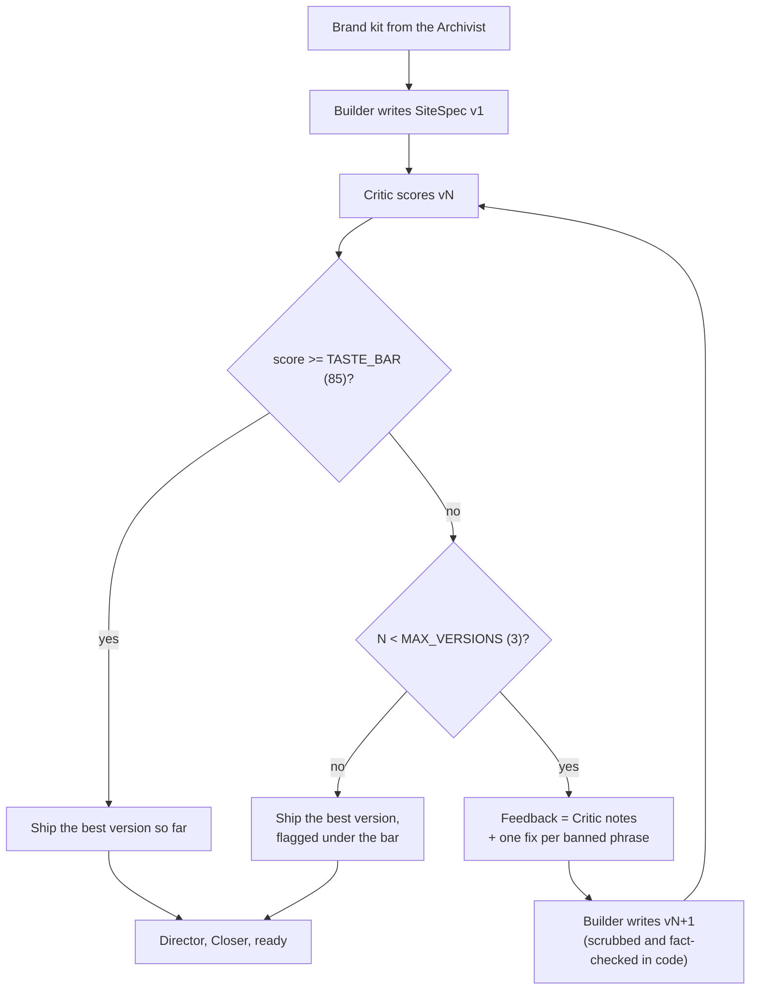

# The taste gate

Most generated websites fail the same way: a headline that could belong to any business, stock phrases like "nestled in the heart of", and confident claims nobody checked. Cold Open's answer is a loop. The **Builder** writes a draft, the **Critic** scores it, and anything under **85** goes back with specific notes, up to **three** versions. The best version ships, and every version's score and notes stay visible.

This page explains exactly how that score is produced, which parts come from a model and which are plain code, what happened on the live demo, and how to tune it.

- [The loop](#the-loop)
- [How a score is computed](#how-a-score-is-computed)
- [The rubric: 14 checks, 100 points](#the-rubric-14-checks-100-points)
- [Structural deductions](#structural-deductions)
- [The banned-phrase list](#the-banned-phrase-list)
- [The unsupported-claims fact check](#the-unsupported-claims-fact-check)
- [From notes to the next draft](#from-notes-to-the-next-draft)
- [Best-version shipping](#best-version-shipping)
- [Live results, Sep 28, 2026](#live-results-sep-28-2026)
- [Tuning `TASTE_BAR` and `MAX_VERSIONS`](#tuning-taste_bar-and-max_versions)
- [Known limitations](#known-limitations)
- [Extending the Critic](#extending-the-critic)

## The loop



The loop lives in `runPipeline()` in `src/hq.ts`. The Builder is `composeSite()` in `src/pipeline/builder.ts`; the Critic is `critique()` in `src/pipeline/critic.ts`. Each version gets its own timeout (Builder 120 s, Critic 90 s).

## How a score is computed

The model never writes the score. It answers a checklist; code does the arithmetic.

```
score = clamp(0, 100, round( rubric − 6 × bannedPhrases − structuralDeductions ))
```

| Part | Source | Range |
|---|---|---|
| `rubric` | The model's pass/fail answers to 14 weighted checks. A check the model does not answer counts as passed. | 0 to 100 |
| `bannedPhrases` | Distinct phrases from a fixed list of 56 found anywhere in the draft, by regex. | 6 points each |
| `structuralDeductions` | Fixed code checks: length, structure, prices, location, unsupported claims. | 2 to 10 points per check, plus 6 per unsupported claim (at most 3) |

Why a checklist instead of asking for a number: binary judgments are far more consistent across models than a free 0 to 30 score, and because the score is derived from the same answers that produce the notes, the notes and the score always agree. The code comment in `critic.ts` says as much.

**When the model does not cooperate.** If fewer than 9 of the 14 checks come back with a readable answer (`true`/`false`, `"yes"`/`"no"`, `"pass"`/`"fail"` and similar are all accepted), or every provider fails, the Critic falls back to a heuristic: `rubric = 86`, `provider: "heuristic"`, and the note "Rubric model unavailable — this score only reflects structure, fact checks and banned phrases." Banned phrases and structural deductions still apply. See [Known limitations](#known-limitations) for what that implies.

**Model settings.** `llmJSON` with max 1,200 tokens, temperature 0.1, effort low, and `prefer: "smart"` (on Workers AI, gpt-oss-120b is tried before Llama 3.3). The provider that answered is stored on every `ScoreVersion`, for example `OpenAI gpt-5-mini-2025-08-07` on the live demo.

## The rubric: 14 checks, 100 points

The Critic's prompt gives the model the business facts, the brand kit (with whether the menu was confirmed from the site), the evidence the Archivist actually read, any prices printed on the site, up to 1,500 characters of the site's own text, and the draft as JSON. Then:

> Be strict: answer "pass": true only if you would bet the owner and a senior editor both agree; when in doubt, fail it. Typical first drafts fail 3-5 of these checks.

The checks, from `rubricChecks()` in `src/pipeline/critic.ts` (questions abridged):

| Id | Dimension | Points | The draft passes if |
|---|---|---:|---|
| B1 | Brand fidelity | 10 | Every factual claim (dishes, services, history, seating, décor, distances, transit, sourcing) is supported by the business facts or the site excerpt. Vibe and voice are design direction, not facts. |
| B2 | Brand fidelity | 8 | With site text: at least two concrete details from the business's own website. Without: the facts we have are used in a way that feels specific, not templated. |
| B3 | Brand fidelity | 6 | The tone matches the brand voice (quoted from the kit). |
| B4 | Brand fidelity | 6 | Nothing would make the owner wince: no wrong facts, no awkward claims, nothing that misrepresents what they sell. |
| S1 | Specificity | 9 | The headline contains something only true of this business, not a generic "{category} on {street}" line. |
| S2 | Specificity | 8 | No sentence could be pasted unchanged onto a different business of the same kind. |
| S3 | Specificity | 8 | Each of the three highlights carries a concrete noun (an item, a street, a time, a material). |
| C1 | Clarity | 6 | The headline is 8 words or fewer and says what and where at a glance. |
| C2 | Clarity | 5 | The subheadline adds new information. |
| C3 | Clarity | 5 | The three highlights say three different things. |
| C4 | Clarity | 4 | The about text is 2 to 3 clean sentences that do not repeat other sections. |
| V1 | Voice | 8 | Reads like a confident human copywriter: no filler, puffery, clichés or exclamation marks. |
| V2 | Voice | 7 | Sentences are complete, varied and natural. |
| A1 | CTA | 10 | The button label is a specific, inviting visit or find-us action that fits the business (the button scrolls to address and hours), and does not promise ordering, booking or delivery. |

Totals: brand fidelity 30, specificity 25, clarity 20, voice 15, CTA 10.

For every failed check the model must write a `fix` that quotes the offending text and says what to write instead. The prompt constrains the fixes too: only facts listed above, "never invent dishes, distances, transit, history or superlatives like 'best'", no clichés, and do not critique the hours line (it comes from OpenStreetMap). When the menu is unconfirmed, the prompt tells the Critic that generic items such as "Tacos" are correct and to "Never suggest dish names".

## Structural deductions

Plain code in `structuralChecks()`, applied to every draft, with or without a model. Each produces a note that goes back to the Builder.

| Check | Deduction |
|---|---:|
| Headline longer than 9 words | 3 |
| Headline is just the business name | 2 |
| Subheadline longer than 28 words | 2 |
| Not exactly 3 highlights | 4 |
| Fewer than 3 offerings | 3 |
| Any price shown while the menu is not confirmed from the business's own site | 10 |
| More than one exclamation mark | 2 |
| Generic CTA (`learn more`, `click here`, `submit`, `get started`, `read more`, `discover more`, `explore`, `contact`) | 3 |
| No location in the visible copy (street, neighborhood, landmark, or one of SoMa, South Beach, Mission Bay, Oracle Park, ballpark) | 3 |
| Each unsupported claim, up to 3 | 6 each |

## The banned-phrase list

56 phrases that mark copy as generic marketing or AI filler, each matched by a regex that also catches common variants (`elevat(e|es|ed|ing)`, `mouth-watering`, `in the very heart of`). Each distinct phrase found costs 6 points and is recorded in `ScoreVersion.slopHits`. This part cannot be argued with: it is a regex, not a model.

elevate · unleash · nestled · culinary journey · tantalize · mouthwatering · look no further · in the heart of · whether you're · embark · delve · symphony of flavors · testament · a haven · seamless · unparalleled · world-class · best-kept secret · hidden gem · indulge · delectable · exquisite · gastronomic · feast for the senses · tastebuds · like no other · second to none · something for everyone · one-stop shop · take it to the next level · game-changer · unforgettable · rich tapestry · treasure trove · boasts · state-of-the-art · perfect blend · passion for · passionate about · we pride ourselves · crafted with love · labor of love · curated · vibrant · bespoke · unique experience · experience the · discover the · cozy atmosphere · warm and welcoming · go-to destination · culinary · gourmet · savor every bite · you won't be disappointed · a must-try

("culinary" is not counted separately when "culinary journey" already matched.)

**Automatic cleanup on revisions.** Every list entry also has a `fix`: either a safe replacement (`boasts` → `has`, `curated` → `chosen`, `in the heart of` → `in`, `bespoke` → `custom`, `nestled` → removed) or `null`, meaning the sentence cannot be patched. On a revision, `scrubSlop()` applies the replacements and drops sentences with an unpatchable phrase (when other sentences remain). A headline that still carries a banned phrase after revision is replaced with a factual template headline, because cutting words out of a six-word headline leaves a broken line. First drafts are not scrubbed, so the Critic sees and penalizes what the model actually wrote.

The same list, and a shorter one in the Builder's and Archivist's prompts, keeps the phrases out in the first place. The Closer rejects pitch lines containing any of them.

## The unsupported-claims fact check

Some words are claims about a real business that are easy to get wrong and costly if wrong: history, awards, service modes, sourcing, décor. The Critic looks for them in the draft and checks each one against everything Cold Open actually read.

**Patterns** (`UNSUPPORTED` in `critic.ts`): since/est. + a year, established in, founded in, family-owned, family-run, award-winning, award(s), voted, michelin, five-star / 5-star, top-rated, highly rated, review(s), famous, legendary, world-famous, best in town / the city / SF / San Francisco / the Bay, #1, number one, free delivery, delivery, delivered, reservation(s), order online, signature, house-made, homemade, handmade, made from scratch, from scratch, organic, locally sourced, farm-to-table, fresh daily, baked daily, roasted on-site / in-house, walk-in(s), takeout, takeaway, patio, outdoor seating, wifi, free parking, catering, happy hour, décor, interior(s), mural(s).

**Evidence** is the normalized text of the site's title, descriptions, headings and visible text, the brand story, and every OSM tag. A claim passes if its words appear in the evidence, or if a synonym rule matches. For example, "delivery" is supported by an OSM `delivery=yes` tag; "patio" by `outdoor_seating=yes`; "wifi" by `internet_access=wlan`; "handmade" by "hand crafted" or "from scratch" on the site.

**Each unsupported claim** (up to three) costs 6 points and produces a note like: `Unsupported claim "patio" in "…" — nothing we read says this. Cut it or replace it with a fact.`

**On revisions the Builder enforces it in code.** `unsupportedClaims()` runs on the revised draft, and `applyClaimFixes()` removes every sentence that still contains a flagged claim (or cuts the phrase if it is the only sentence). So a claim the Critic flagged cannot come back under a new sentence, even if the model ignores the note.

## From notes to the next draft

After a failing score, HQ builds the next draft's feedback:

1. The Critic's notes: structural notes first, then the fixes for failed checks, ordered by the check's points, at most 8 in total.
2. One instruction per banned phrase: `Remove the banned/generic phrase "X" and say something specific to {name} instead.`
3. If there are no notes at all: `Score was N/100. Make the headline and copy more specific to {name}.`

Notes are filtered before they reach the Builder: a model-written fix that would introduce a banned phrase, or words like "best", "famous", "award" or "legendary" outside the quoted offending text, is dropped, so a note can never teach the Builder to get worse.

The Builder's revision prompt includes the previous draft and the numbered notes, with "Fix EVERY note so the change is visible; rewrite whole lines rather than patching words, and keep what already worked." It warns that a note's suggested wording is only a hint and must not add facts or banned phrases. Revisions run at temperature 0.5 with `effort: "medium"`, and on Workers AI the reasoning model is tried first. The theme is kept unless a note mentions it.

## Best-version shipping

A revision can score lower than the draft before it. HQ tracks the best version as it goes (a later version must score **strictly higher** to replace it, so ties keep the earlier draft). After the loop:

- If the saved `biz.site` is not the best version, HQ puts the best one back and posts `Shipping vN (score) — the later draft scored lower, so it doesn't make the cut.`
- If the best score is still under the bar after all versions, HQ posts a `warn`: `Best effort is vN at S, under the 85 bar after 3 passes. Shipping it flagged; Rebuild takes another swing.`

Every version stays in `biz.scores` with its score, notes, banned-phrase hits, provider and timestamp, and Mission Control's drawer shows the whole history. The **Taste-passed** stat counts built businesses whose **shipped** version scored 85 or more; nothing else feeds it.

A **Rebuild** clears `scores` and starts a fresh loop.

## Live results, Sep 28, 2026

These are the score loops recorded on the public demo at the Startup Speedrun Hackathon, running on OpenAI `gpt-5-mini`. They are the only results we cite; nothing here is a benchmark.

| Business | Scores by version | Shipped |
|---|---|---|
| Tres | 31 → 67 → 88 | v3 |
| Arsicault Bakery | 49 → 68 → 96 | v3 |
| 58 Social | 44 → 88 | v2 |
| Bravado | 58 → 96 | v2 |
| Zaika Indian Cuisine | 63 → 96 | v2 |
| Momo's | 64 → 96 | v2 |
| El Porteño | 65 → 96 | v2, after a Builder fix |
| Victory Hall & Parlor | 72 → 100 | v2 |
| Guitar Solo | 88 | v1 · 38.9 s Live challenge |
| Game Post | 96 | v1 · 38.5 s best build |

Other numbers from the same day:

- 24 businesses scouted, 16 sites built.
- Fastest build end to end: Game Post in 38.5 s (96 on the first pass). Guitar Solo: 38.9 s, scored 88.
- Average build: about 1 minute. Estimated model cost: about 4 to 6¢ per site, under $1 for the whole board.
- Brainbase second opinion on Underdogs Cantina: 76, in about 146 s. It is an independent review and does not change the shipped score.

## Tuning `TASTE_BAR` and `MAX_VERSIONS`

Both are constants at the top of `src/hq.ts`:

```ts
const TASTE_BAR = 85;
const MAX_VERSIONS = 3;
```

Change them and redeploy. They are published at `GET /api/config` as `tasteBar` and `maxVersions`; Mission Control reads `tasteBar` for its taste rings and the Critic's role label (it falls back to 85 if the config request fails). The agent-channel messages use the constants directly.

Things to know before you change them:

- **Each extra version costs one Builder call and one Critic call**, in time and money. The worst case per build is `MAX_VERSIONS × (120 s + 90 s)` of stage timeouts before the Director even starts.
- **A bar above 86 cannot be reached without a model.** The heuristic fallback starts at 86 and only subtracts. With no provider answering, every build would ship flagged.
- **A lower bar ships more first drafts.** On the live demo, several first drafts scored in the 60s and reached 96 on v2, so the loop was doing real work at 85.
- **`MAX_VERSIONS = 1`** turns the gate into a score-only pass: nothing is revised, and anything under the bar ships flagged.
- **The penalty weights** (6 points per banned phrase, the structural deductions) are in `critic.ts`. If you change the rubric points, keep the five dimensions summing to 100 so scores stay comparable.
- **Redeploying restarts the Durable Object** and interrupts builds in progress. They resume automatically (the first six), but avoid deploying while a demo is running.

## Known limitations

We would rather list these than have you find them.

- **The heuristic fallback can pass a draft.** With no model answering the rubric, a draft with no banned phrases and no structural problems scores 86 and clears the default bar. It is labeled `provider: "heuristic"` with an explanatory note, but it is still counted as Taste-passed.
- **The Critic and the Builder may be the same model.** With a single provider configured, the model grades its own family's writing. The deterministic checks and the independent [Brainbase second opinion](AGENTS.md#brainbase-second-opinion) exist partly for that reason.
- **LLM judgments vary.** The same draft can pass or fail a borderline check on different runs. Temperature 0.1 and binary checks reduce this; they do not remove it.
- **The preview's provenance panel shows the last score, not the shipped one.** "How this preview was made" in `src/site/render.ts` prints the last entry in `biz.scores` and the word "Cleared", even when an earlier version was shipped or the best score was under the bar. The drawer in Mission Control and the stats use the shipped version correctly.
- **Taste Labs does not score drafts today.** `tasteScore()` exists in `src/integrations/taste.ts`, but the pipeline does not call it. Taste Labs is used only for brand extraction in the Archivist.
- **Regex matching is literal.** The banned-phrase and claim patterns catch the listed wording and close variants, not every paraphrase.

## Extending the Critic

- **Add a check:** add a `RubricCheck` to `rubricChecks()` with an id, a dimension, points and a yes/no question. Rebalance the points so the total stays 100. The prompt and the JSON shape are generated from the list.
- **Ban a phrase:** add `{ label, re, fix }` to `SLOP`. Use a global, case-insensitive regex with word boundaries. Give it a `fix` only if the replacement reads correctly in any sentence; otherwise `null`.
- **Guard a new kind of claim:** add the pattern to `UNSUPPORTED`, and if it can be supported by an OSM tag or different site wording, add a `CLAIM_SYNONYMS` entry. The Builder picks it up automatically through `unsupportedClaims()`.
- **Add a structural rule:** push a `{ deduct, note }` from `structuralChecks()`. Write the note as an instruction the Builder can act on, quoting the offending text.
- **Use a second scorer:** keep it out of the blocking loop if it is slow. The Brainbase second opinion (background, event-only) is the pattern to follow; `tasteStartAdherence()` / `tasteGetAdherence()` in `taste.ts` are written for the same approach.
